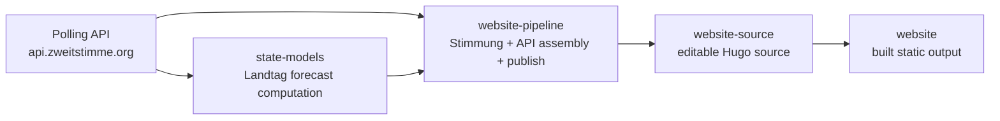

# zweitstimme.org website-source

Editable Hugo source for [zweitstimme.org](https://zweitstimme.org).

This repository is the **authoring and build-input layer** of the deployment stack: content, layouts, config, static assets, and generated data/API files are assembled here before Hugo builds the public site.

## Role in the stack



## Repository boundary

- **`state-models`** computes Landtag forecasts and posterior draws
- **`website-pipeline`** runs Stimmung, assembles `/api/...`, copies generated data into this repo, and applies website integration patches
- **`website-source`** is the editable Hugo source used to build the live site
- **`website`** is the compiled static output served by GitHub Pages

In other words: this repo should contain the source that Hugo needs, but not the core forecasting logic itself.

## Deployment

A push to `main` triggers the site build that updates the built `website` repository and therefore the public site.

The deploy copies this README into `website` (`public/README.md`) so the built-output repo keeps a description even though each deploy is an orphan commit.

## Local development

```bash
hugo server
```

## Production build

```bash
hugo --minify
```

The built site lands in `public/`.
