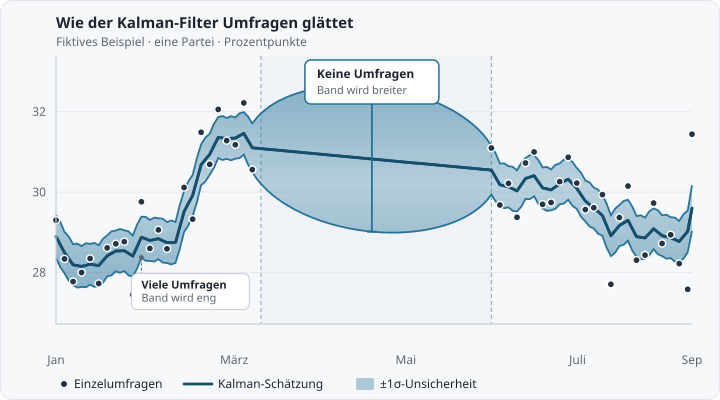

## Die Berechnung der Umfragewerte bei Zweitstimme.org

Die Balken und Linien auf der Startseite zeigen keine einzelne Umfrage, sondern eine **latente Stimmung**: eine geglättete Schätzung der aktuellen Parteienunterstützung. Sie wird in unserer Datenpipeline mit einem **Kalman-Filter** aus allen verfügbaren Umfragen berechnet — und aktualisiert, wenn neue Umfragen verfügbar sind. Die einzelnen Umfragen selbst erscheinen als **Punkte** in den Verlaufsdiagrammen und in der Umfragenliste.

### Warum Kalman-Filter statt Einzelumfragen?

Einzelne Umfragen schwanken — wegen Stichprobenfehlern, unterschiedlicher Erhebungsmethoden und kurzfristiger Stimmungsänderungen. Der Kalman-Filter fasst viele Umfragen über die Zeit zu einer stabilen Schätzung zusammen, glättet zufälliges Rauschen und erzeugt eine durchgehende Zeitreihe auch an Tagen ohne neue Umfrage.

<figure class="kalman-demo" style="margin: 1.75rem 0;">
  
  <figcaption style="margin-top: 0.65rem; font-size: 0.92rem; color: var(--secondary, #666); line-height: 1.45;">
    Schematisches Beispiel: Die Punkte sind einzelne Umfragen mit Messrauschen. Die Linie ist die geglättete latente Stimmung (RTS-Smoother). Das Band zeigt die ±1σ-Unsicherheit: bei vielen Umfragen eng, in einer längeren Lücke ohne Umfragen breiter (Linsenform).
  </figcaption>
</figure>

### Die Datenbasis

- **Quellen**: Umfragen aus [DAWUM](https://dawum.de) und [wahlrecht.de](https://www.wahlrecht.de/umfragen/), bereitgestellt über die [Fasttrack-Polling-API](https://api.fasttrack29.com)
- **Bund und Länder**: Bundesumfragen sowie Umfragen zu allen 16 Landtagen
- **Zeitraum**: bis zu 10 Jahre Historie für Verlaufsdiagramme
- **Parteien**: CDU/CSU, SPD, AfD, GRÜNE, LINKE, BSW, FDP sowie — je nach Verfügbarkeit — FW, SSW, PIRATEN, REP und Sonstige

### Wo die Berechnung stattfindet

Die Kalman-Schätzung läuft **serverseitig** in unserer R-Pipeline und wird neu berechnet, wenn neue Umfragen verfügbar sind. Die Website lädt die fertigen Zeitreihen als JSON (`stimmung_federal.json`, `stimmung_states.json`). Einzelne Umfragen für Punkte und Tabellen werden im Browser direkt von der Polling-API abgerufen.

### Schritt für Schritt

1. **Umfragen sammeln** — Alle Umfragen im gewählten Zeitraum werden aus der API geladen.
2. **Parteinamen vereinheitlichen** — unterschiedliche Institutsbezeichnungen werden auf ein gemeinsames Schema gebracht (siehe [unten](#parteikonsolidierung)).
3. **Tägliche Beobachtungen** — Für jeden Tag und jede Partei: Falls an diesem Tag eine oder mehrere Umfragen vorliegen, wird der **einfache Mittelwert** der Tagesumfragen als Beobachtung verwendet. Tage ohne Umfrage bleiben leer.
4. **Parameter schätzen** — Prozessrauschen  und Messrauschen  werden aus den Umfragen des jeweiligen Gebiets kalibriert (siehe [unten](#das-mathematische-modell)).
5. **Kalman-Filter pro Partei** — Für jede Partei wird unabhängig ein eindimensionaler **Random-Walk-Kalman-Filter** über die tägliche Zeitreihe gefahren.
6. **Glättung (RTS-Smoother)** — Für die Verlaufslinien nutzen wir den **Rauch–Tung–Striebel-Smoother**, der die gesamte Zeitreihe rückwärts glättet und damit auch Lücken zwischen Umfragen sinnvoll überbrückt. Der **aktuelle** Balkenwert bleibt dabei kausal: Am letzten Tag stimmen Smoother und Vorwärts-Filter überein, es fließen also nur Umfragen bis heute ein — genau wie beim latenten Umfragewert der [Vorhersage](/blog/posts/state-forecast-methodology/).
7. **Aktive Parteien bestimmen** — Für jeden Tag wird geprüft, welche Parteien von den Instituten zu diesem Zeitpunkt überhaupt einzeln ausgewiesen werden ([Details unten](#parteien-kommen-und-gehen)). Nur diese „aktiven“ Parteien erscheinen als Linie bzw. Balken.
8. **Normalisierung** — Die aktiven Parteien behalten ihre geglätteten Werte; **„Sonstige“ wird als Rest zu 100 %** über die aktiven Parteien berechnet. Parteien, die (noch oder nicht mehr) nicht aktiv erhoben werden, sind damit automatisch in „Sonstige“ enthalten.

### Das mathematische Modell

Für jede Partei gilt ein einfaches Zustandsraummodell:

- **Zustand** : die (unbeobachtete) latente Unterstützung an Tag 
- **Übergang**:  — die Stimmung darf sich langsam ändern (Random Walk)
- **Beobachtung**:  — an Umfragetagen messen wir  als Tagesmittel der Umfragen

Zwei Parameter steuern, wie stark geglättet wird — und beide werden **nicht fest vorgegeben**, sondern **bei jedem Pipelinelauf aus den Umfragen des jeweiligen Gebiets geschätzt** (eigene Werte für Bund und jedes Bundesland):

| Parameter | Bedeutung | Wirkung |
|-----------|-----------|---------|
| **q** (Prozessrauschen) | Wie schnell sich die latente Stimmung ändern darf | größeres  → reaktivere Linie |
| **r** (Messrauschen) | Wie stark einzelne Umfragen vom wahren Wert abweichen können | größeres  → stärkere Glättung |

**So schätzen wir sie** (passend zur Beobachtungsgleichung des Filters):

1. **** aus der Streuung mehrerer Umfragen **am selben Tag** (dieselbe Partei, verschiedene Institute) — das ist der typische Messfehler einer einzelnen Umfrage.
2. **** aus der Restbewegung der **Tagesmittel** zwischen aufeinanderfolgenden Umfragetagen, nachdem dieser Messfehler herausgerechnet wurde:

Typische Größenordnungen:  (Messfehler etwa ±1–1,4 Prozentpunkte) und  pro Tag (Drift grob ±3–6 Prozentpunkte pro Jahr). Fehlen genug Beobachtungspaare oder wäre eine Schätzung nicht positiv, greifen Fallback-Werte.

#### Die Unsicherheitsbänder

Das farbige Band um jede Linie zeigt die **±1σ-Unsicherheit** (ca. 68 %-Intervall) der Kalman-Schätzung. Charakteristisch — und beabsichtigt — ist seine **Linsenform bei dünner Umfragelage**: An Tagen mit einer Umfrage ist die Schätzung am sichersten (das Band schnürt sich zusammen), zwischen zwei weit auseinanderliegenden Umfragen wächst die Unsicherheit und das Band wird breiter. In den Länderdiagrammen mit wenigen Umfragen pro Jahr ist dieser Effekt deutlich sichtbar; im Bundesdiagramm mit fast täglichen Umfragen bleibt das Band gleichmäßig schmal.

### Wenn Parteien in Umfragen kommen und gehen {#parteien-kommen-und-gehen}

Nicht jede Umfrage weist dieselben Parteien aus — und das ändert sich über die Zeit. Das BSW etwa taucht erst ab Anfang 2024 in Umfragen auf; umgekehrt weisen Institute Parteien wie die FDP in manchen Bundesländern irgendwann nicht mehr einzeln aus, sobald sie dauerhaft unter der Wahrnehmungsschwelle liegen. Dazu kommt: Auch **zum selben Zeitpunkt** unterscheiden sich die Institute — das eine fragt das BSW ab, das andere nicht. Das hat zwei wichtige Konsequenzen für die Berechnung:

**1. Fehlend heißt nicht null.** Wenn ein Institut eine Partei nicht ausweist, heißt das nicht, dass sie dort 0 % hat — ihr Anteil steckt dann in „Sonstige“ dieses Instituts. Üblich ist das unterhalb von etwa 3 %. Damit die Linie einer solchen Partei nicht auf ihrem letzten (zu hohen) Wert stehen bleibt, behandeln wir sie in Umfragen ohne eigenen Ausweis für **90 Tage** nach dem letzten ausgewiesenen Wert so, als stünde sie bei **2 %** — derselbe Ansatz wie bei den latenten Umfragewerten der Vorhersage. Danach fließt sie nicht mehr in die Schätzung ein, bis wieder ein echter Umfragewert vorliegt.

**2. „Sonstige“ ist nicht direkt vergleichbar.** Meldet Institut A das BSW mit 4 % und „Sonstige“ mit 5 %, während Institut B kein BSW ausweist und „Sonstige“ mit 9 % meldet, dann messen beide etwas anderes: Bei Institut B steckt das BSW **in** den Sonstigen. Deshalb berechnen wir „Sonstige“ in Balken und Linien nie aus den gemeldeten Sonstige-Werten, sondern immer als **Rest zu 100 %** über die angezeigten Parteien.

#### Welche Parteien werden angezeigt?

Für jeden Tag bestimmen wir, welche Parteien zum **aktuell erhobenen Parteienspektrum** gehören. Als Referenz dienen alle Umfragen der letzten 90 Tage, mindestens aber die letzten 5 Umfragen (wichtig für Bundesländer mit wenigen Umfragen):

- **Aufnahme**: Eine Partei wird angezeigt, sobald mindestens **40 %** der Umfragen im Referenzfenster sie einzeln ausweisen.
- **Ausschluss**: Sie wird ausgeblendet, wenn ihr Anteil unter **10 %** der Umfragen fällt (bei dünner Umfragelage zusätzlich erst, wenn 30 Tage lang keine Umfrage sie ausgewiesen hat).
- **Dazwischen** bleibt der bisherige Zustand bestehen — so „flackern“ Linien nicht, wenn einzelne Institute eine Partei vorübergehend weglassen.

Das bedeutet konkret:

- **Verlauf**: Die Linie einer Partei **beginnt**, wenn sie erhoben wird (das BSW hat vor 2024 keine Linie — es existierte schlicht noch nicht), und **endet**, wenn die Institute sie nicht mehr ausweisen (z. B. die FDP in Sachsen ab Ende 2024). Außerhalb dieses Zeitraums ist ihr Anteil im grauen „Sonstige“-Band enthalten.
- **Aktuell**: In den Balken erscheinen nur aktuell erhobene Parteien. Eine Partei, die nicht mehr abgefragt wird, bleibt nicht mit ihrem letzten (veralteten) Wert stehen, sondern wird in „Sonstige“ überführt.
- **Punkte**: Die Umfragepunkte zeigen weiterhin die rohen gemeldeten Werte. Einzige Ausnahme: Der **Sonstige-Punkt** einer Umfrage wird an das angezeigte Parteienset angepasst — weist eine Umfrage z. B. das BSW nicht aus, ziehen wir dessen geschätzten Tageswert von ihrem gemeldeten Sonstige-Wert ab, damit der Punkt mit der Sonstige-Linie vergleichbar ist. Der Tooltip zeigt in diesem Fall zusätzlich den ursprünglich gemeldeten Wert.

Diese Regeln lösen ein subtiles Problem: Ohne sie würde der plötzliche Wegfall einer Partei bei einem einzelnen Institut die „Sonstige“-Werte scheinbar um mehrere Prozentpunkte springen lassen — obwohl sich an der tatsächlichen Stimmung nichts geändert hat, nur an der Frage, **welche Parteien einzeln ausgewiesen werden**.

### Was auf der Website angezeigt wird

| Element | Quelle | Methode |
|---------|--------|---------|
| **Aktuell**-Balken | Pipeline-JSON | Letzter Wert der geglätteten Kalman-Zeitreihe (nur aktuell erhobene Parteien) |
| **Verlauf**-Linien | Pipeline-JSON | Geglättete Kalman-Zeitreihe im gewählten Zeitraum; Linien beginnen/enden mit der Erhebung der Partei |
| **Punkte** | Live-API | Rohe Einzelumfragen (ungeglättet); Sonstige-Punkte an das angezeigte Parteienset angepasst |
| **Umfragenliste** | Live-API | Rohe Einzelumfragen, wie vom Institut gemeldet |

Der Kalman-Filter **gewichtet Institute nicht unterschiedlich** und **lernt keine Institutseffekte** — jede Umfrage am selben Tag zählt gleich im Tagesmittel. Das unterscheidet unsere Stimmungsanzeige von gewichteten Poll-of-Polls-Aggregatoren.

### Parteikonsolidierung

Nicht alle Umfrageinstitute verwenden dieselben Parteinamen. Wir fassen sie in ein einheitliches Schema zusammen:

- **CDU/CSU** — Christlich Demokratische Union / Christlich-Soziale Union
- **SPD**, **AfD**, **GRÜNE**, **LINKE**, **BSW**, **FDP**
- Regional zusätzlich z. B. **FW** (Freie Wähler) und **SSW**
- **Sonstige** — übrige Parteien; in Balken und Linien immer als **Rest zu 100 %** über die angezeigten Parteien berechnet (siehe [oben](#parteien-kommen-und-gehen))

### Aktualisierung

- **Bei neuen Umfragen**: Die Pipeline lädt verfügbare Umfragen, schätzt  und  neu und berechnet die Kalman-Zeitreihen.
- **Auf der Website**: Balken und Linien kommen aus den aktualisierten JSON-Dateien; Punkte und Tabellen aktualisieren sich beim Seitenaufruf aus der Live-API.

### Vergleich mit anderen Methoden

| Methode | Eigenschaft |
|---------|-------------|
| **Gewichteter Mittelwert / Poll of Polls** | Fokus auf aktuelle Umfragen, oft mit Institutsgewichten |
| **Einfacher Durchschnitt** | Ignoriert zeitliche Entwicklung |
| **Gleitender Mittelwert** | Festes Zeitfenster, harte Kante am Fensterrand |
| **Kalman-Filter (unsere Methode)** | Nutzt die gesamte Historie, glättet über Zeit, füllt Lücken, liefert eine latente Stimmung |

### Fazit

Die Balken und Linien auf Zweitstimme.org zeigen eine **Kalman-geglättete latente Stimmung**, die aus allen verfügbaren Umfragen berechnet und bei neuen Umfragen aktualisiert wird. Einzelne Umfragen bleiben als Punkte sichtbar. So erhalten Sie eine stabilere Einschätzung der politischen Lage als aus einer einzelnen Umfrage oder einem einfachen Durchschnitt — bei voller Transparenz über die zugrunde liegenden Rohdaten.

---

**Wie aus der Stimmung eine Wahlprognose wird, erklären wir im Artikel [zur Landtagswahl-Vorhersage](/blog/posts/state-forecast-methodology/). Weitere Informationen finden Sie in unserem [FAQ](/faq).**

<link rel="stylesheet" href="https://cdn.jsdelivr.net/npm/katex@0.16.11/dist/katex.min.css" crossorigin="anonymous">

