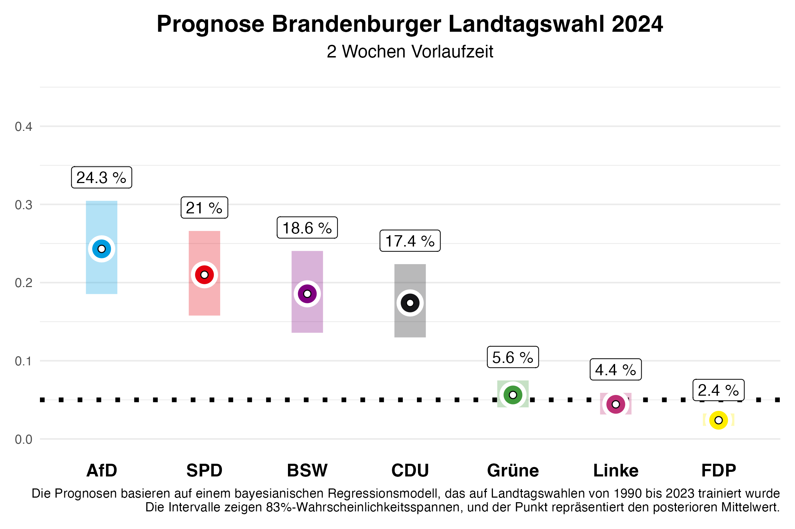
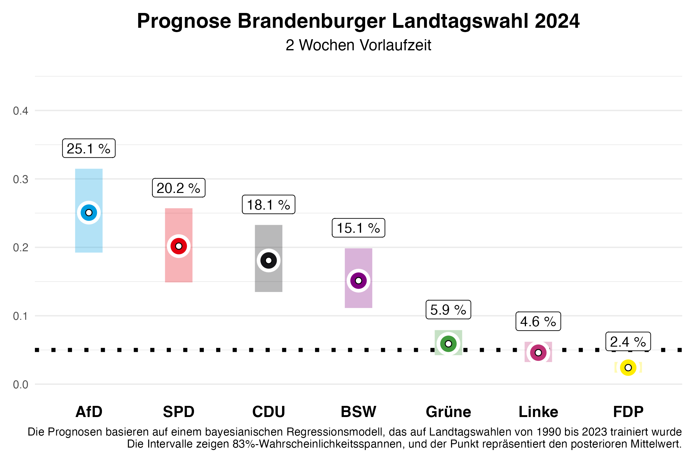

In zwei Wochen findet die Landtagswahl in Brandenburg statt. Wir von Zweitstimme haben nun auch ein Vorhersagemodell für Landtagswahlen entwickelt und freuen uns, die Vorhersage mit zwei Wochen Vorlaufzeit auf dieser Seite präsentieren zu können -- wie bereits für Sachsen und Thüringen.

# Die Vorhersage

## Brandenburg

In Brandenburg zeigt unsere aktuelle Vorhersage ein **enges Rennen** zwischen vier Parteien; AfD, SPD, BSW und CDU liegen alle um die 20%. Für die **SPD**, die bei der letzten Wahl die stärkste Partei wurde, erwarten wir **21,0%** der Stimmen, wobei unsere Vorhersage zwei Wochen vor der Wahl noch eine 5/6-Wahrscheinlichkeit zulässt, dass dieser Wert im Intervall zwischen **15,8%** und **26,6%** liegen wird (in bayesscher Sprache: 5/6-Kredibilitätsintervall). **Die AfD** dürfte sich hingegen deutlich verbessern und wird unseren Erwartungen nach mit **24,3%** knapp vor der SPD liegen. Hier reicht das Intervall allerdings ebenfalls noch von **18,5%** bis **30,5%**.

Das neu gegründete Bündnis Sahra Wagenknecht (BSW) könnte in Brandenburg mit **18,6%** ein starkes Ergebnis erzielen, mit einem 5/6-Kredibilitätsintervall von **13,6%** bis **24,0%**. Die **CDU** wird sich mit **17,4%** zufrieden geben müssen (Intervall: **13,0%** bis **22,4%**), ebenso wie die **Grünen** mit **5,6%** (Intervall: **4,0%** bis **7,5%**), die 2019 mit **10,8%** relativ gut abschnitten. Die **Linke**, die zuletzt **10,7%** der Stimmen erzielte, könnte dieses Mal nur **4,4%** erreichen (Intervall: **3,1%** bis **5,9%**). Die **FDP**, die schon 2019 den Einzug in den Landtag mit **2,4%** knapp verfehlte, wird voraussichtlich bei **2,4%** (Intervall: **1,7%** bis **3,3%**) landen und **wahrscheinlich** erneut scheitern. Die restlichen Stimmenanteile entfallen auf „sonstige” Parteien, die in den Abbildungen nicht dargestellt sind.

Was bedeutet das für die zukünftige politische Landschaft in Brandenburg? Unsere Vorhersage erlaubt es uns, Wahrscheinlichkeiten für bestimmte Ereignisse zu berechnen. Die Wahrscheinlichkeit, dass die SPD erneut die stärkste Kraft wird, beziffert unsere Vorhersage mit **24%**, wobei es schwieriger wird, eine Mehrheit ohne die AfD zu bilden, die mit einer Wahrscheinlichkeit von **61%** stärkste Kraft wird. Für die CDU sind es **5%** und für das BSW **10%**. Die Wahrscheinlichkeit, dass es eine Mehrheit für die amtierende Koalition aus SPD, CDU und Grünen gibt, liegt bei **34%**. Ein Grund dafür ist, dass die Grünen eine Wahrscheinlichkeit von **66%** haben, den Einzug in den Landtag zu schaffen. Für die **Linke** sind es nur **25%**. Eine Regierungsmehrheit aller Parteien ohne AfD und BSW gibt es zu **56%**.

# Das Vorhersagemodell

Unsere Vorhersagen basieren auf einem Bayes'schen Regressionsmodell, das wir auf den Daten aller Landtagswahlen seit 1990 schätzen und dann zur Vorhersage der bevorstehenden Landtagswahlen nutzen. Zur Vorhersage nutzen wir Informationen über die Regierungsbeteiligung der Parteien, ob eine Partei den/die Ministerpräsident/in stellt, ob eine Partei neu bei den Landtagswahlen antritt, das letzte Wahlergebnis der Partei, die durchschnittliche Abweichung der Partei in den bundesweiten Umfragen vom letzten Bundestagswahlergebnis und den durchschnittlichen Zuspruch in den Umfragen, die vor der Landtagswahl von den verschiedenen Umfrageinstituten publiziert werden. Die Umfragen im Land haben bei der Vorhersage den größten Einfluss.

Wie gut funktioniert unser Modell? Wir haben das Modell anhand der Landtagswahlen seit 2010 evaluiert und dazu probeweise diese Landtagswahlen vorhergesagt, wobei wir nur Daten genutzt haben, die vor der jeweiligen Landtagswahl bereitstanden. Im Durchschnitt liegt die absolute Abweichung zum Endergebnis zwei Wochen vor der Wahl bei **2,19 Prozentpunkten**. Das bedeutet, es kann noch einiges in den nächsten zwei Wochen passieren. Wenn wir die Vorhersage zwei Tage vor der Wahl, also am Freitag, machen, wird die Vorhersage präziser und wir liegen mit **1,46 Prozentpunkten** durchschnittlicher absoluter Abweichung vom Endergebnis deutlich näher dran. 

## Modell nur auf Basis von Umfragen

In vorherigen Blogposts hatten wir unsere Vorhersagen für die Landtagswahlen in Sachsen und Thüringen am 01.09.2024 veröffentlicht. Unser volles Modell hat dabei auch berücksichtigt, dass das BSW als neue Partei angetreten ist, und eine entsprechende Vorhersage gemacht. Im Vergleich zum Endergebnis hat das dazu geführt, dass der Stimmenanteil des BSW überschätzt wurde. Deswegen präsentieren wir für die Brandenburger Landtagswahl auch Vorhersagen eines Modells, dass nur auf Informationen aus Umfragen basiert und neue Parteien nicht besonders berücksichtigt. Sollte das BSW auch in Brandenburg nicht die Umfragen deutlich übertreffen, wird diese Vorhersage möglicherweise näher am Endergebnis liegen.

