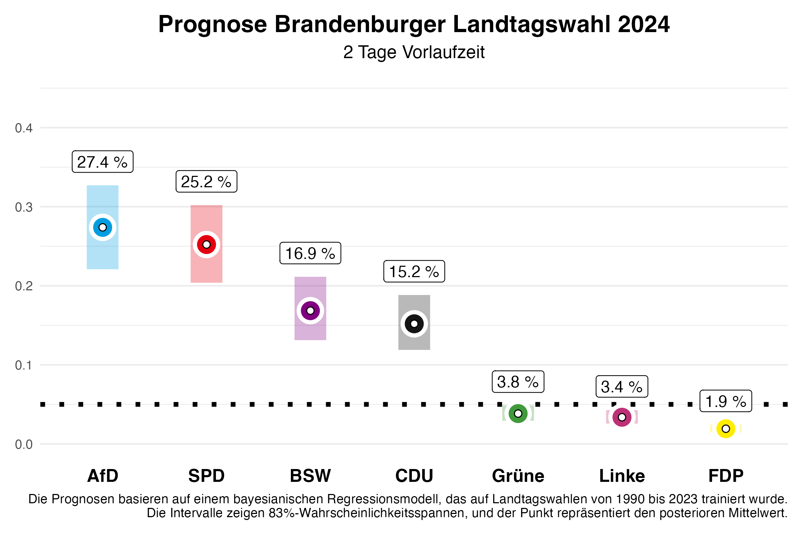
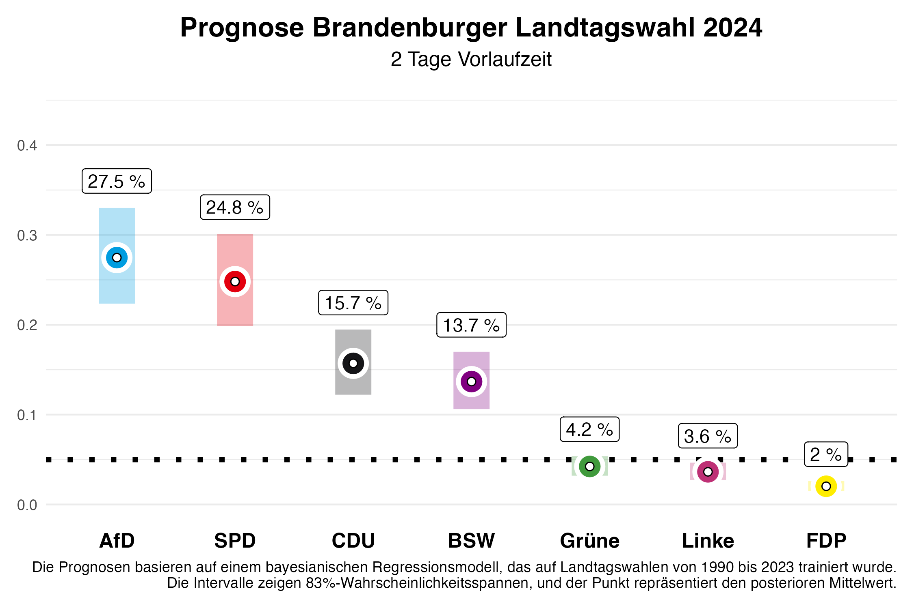

Vor zwei Wochen haben wir Vorhersagen für die Landtagswahl in Brandenburg hier publiziert. Diese aktualisieren wir heute – zwei Tage vor der Wahl – mit unserem Vorhersagemodell, basierend auf den in der Zwischenzeit veröffentlichten Umfragen. Anhand der vorherigen Landtagswahlen von 2010 bis 2023 wissen wir, dass unsere Vorhersagen zwei Tage vorher bereits sehr genau sind. Wir liegen mit einer durchschnittlichen absoluten Abweichung von 1,46 Prozentpunkten für alle Parteien sehr nahe am Endergebnis.

# Die Vorhersage

## Brandenburg

In Brandenburg zeigt unsere aktuelle Vorhersage, dass sich AfD und SPD deutlich von BSW und CDU abgesetzt haben. Für die **SPD**, die bei der letzten Wahl die stärkste Partei wurde, erwarten wir **25,2%** der Stimmen, wobei unsere Vorhersage zwei Tage vor der Wahl noch eine 5/6-Wahrscheinlichkeit zulässt, dass dieser Wert im Intervall zwischen **20,4%** und **30,2%** liegen wird (in bayesscher Sprache: 5/6-Kredibilitätsintervall). **Die AfD** dürfte sich hingegen deutlich verbessern und wird unseren Erwartungen nach mit **27,4%** knapp vor der SPD liegen. Hier reicht das Intervall allerdings ebenfalls noch von **22,1%** bis **32,7%**.

Das neu gegründete Bündnis Sahra Wagenknecht (BSW) könnte in Brandenburg mit **16,9%** ein starkes Ergebnis erzielen, mit einem 5/6-Kredibilitätsintervall von **13,1%** bis **21,1%** — allerdings deutlich weniger als noch vor zwei Wochen vorhergesagt. Die **CDU** wird sich mit **15,2%** zufrieden geben müssen (Intervall: **11,9%** bis **18,8%**), ebenso wie die **Grünen** mit **3,8%** (Intervall: **2,9%** bis **4,9%**), die 2019 mit **10,8%** relativ gut abschnitten. Die **Linke**, die zuletzt **10,7%** der Stimmen erzielte, könnte dieses Mal nur **3,4%** erreichen (Intervall: **2,6%** bis **4,3%**). Die **FDP**, die schon 2019 den Einzug in den Landtag mit **2,4%** knapp verfehlte, wird voraussichtlich bei **1,9%** (Intervall: **1,4%** bis **2,4%**) landen und **wahrscheinlich** erneut scheitern. Die restlichen Stimmenanteile entfallen auf „sonstige” Parteien, die in den Abbildungen nicht dargestellt sind.

Was bedeutet das für die zukünftige politische Landschaft in Brandenburg? Unsere Vorhersage erlaubt es uns, Wahrscheinlichkeiten für bestimmte Ereignisse zu berechnen. Die Wahrscheinlichkeit, dass die SPD erneut die stärkste Kraft wird, beziffert unsere Vorhersage mit **35%**, wobei es schwieriger wird, eine Mehrheit ohne die AfD zu bilden, die mit einer Wahrscheinlichkeit von **64%** stärkste Kraft wird. Für die CDU und das BSW sind es **0%**, stärkste Kraft zu werden. Die Wahrscheinlichkeit, dass es eine Mehrheit für die amtierende Koalition aus SPD, CDU und Grünen gibt, liegt nur noch bei **4%**. Ein Grund dafür ist, dass die Grünen nur noch eine Wahrscheinlichkeit von **7%** haben, den Einzug in den Landtag zu schaffen. Für die **Linke** sind es nur **2%**. Eine Regierungsmehrheit aller Parteien ohne AfD und BSW gibt es zu **31%**. Allerdings gilt es hierbei zu beachten, dass Parteien in Brandenburg auch dann ins Parlament einziehen, wenn sie mindestens ein Direktmandat gewinnen. Diese Möglichkeit wurde bei den Wahrscheinlichkeiten nicht berücksichtigt.

# Das Vorhersagemodell

Am Kongress der Deutschen Vereinigung für Politikwissenschaften 2024, vom 24.-27.09. in Göttingen, werden wir ein Forschungspapier zu unserem Vorhersagemodell für Landtagswahlen vorstellen. Unsere Vorhersagen basieren auf einem Bayes'schen Regressionsmodell, das wir auf den Daten aller Landtagswahlen seit 1990 schätzen und dann zur Vorhersage der bevorstehenden Landtagswahlen nutzen. Zur Vorhersage nutzen wir Informationen über die Regierungsbeteiligung der Parteien, ob eine Partei den/die Ministerpräsident/in stellt, ob eine Partei neu bei den Landtagswahlen antritt, das letzte Wahlergebnis der Partei, die durchschnittliche Abweichung der Partei in den bundesweiten Umfragen vom letzten Bundestagswahlergebnis und den durchschnittlichen Zuspruch in den Umfragen, die vor der Landtagswahl von den verschiedenen Umfrageinstituten publiziert werden. Die Umfragen im Land haben bei der Vorhersage den größten Einfluss.

## Modell nur auf Basis von Umfragen

In vorherigen Blogposts hatten wir unsere Vorhersagen für die Landtagswahlen in Sachsen und Thüringen am 01.09.2024 veröffentlicht. Unser volles Modell hat dabei auch berücksichtigt, dass das BSW als neue Partei angetreten ist, und eine entsprechende Vorhersage gemacht. Im Vergleich zum Endergebnis hat das dazu geführt, dass der Stimmenanteil des BSW überschätzt wurde. Deswegen präsentieren wir für die Brandenburger Landtagswahl auch Vorhersagen eines Modells, dass nur auf Informationen aus Umfragen basiert und neue Parteien nicht besonders berücksichtigt. Sollte das BSW auch in Brandenburg nicht die Umfragen deutlich übertreffen, wird diese Vorhersage möglicherweise näher am Endergebnis liegen.