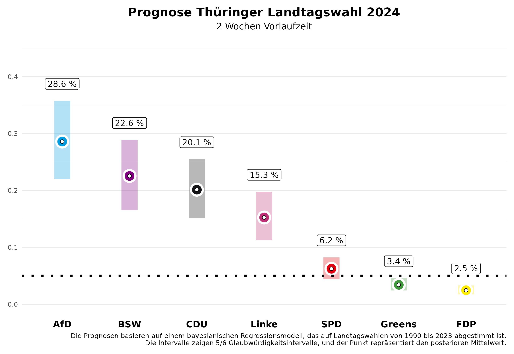

In zwei Wochen finden die Landtagswahlen in Sachsen und Thüringen statt. Wir von Zweitstimme haben nun auch ein Vorhersagemodell für Landtagswahlen entwickelt und freuen uns, die Vorhersagen mit zwei Wochen Vorlaufzeit auf dieser Seite präsentieren zu können.

# Die Vorhersage

## Sachsen

In Sachsen zeigt unsere aktuelle Vorhersage ein spannendes Kopf-an-Kopf-Rennen zwischen der CDU und der AfD. Für die CDU, die bei der letzten Wahl die größte Partei wurde, erwarten wir **30,0%** der Stimmen, wobei unsere Vorhersage zwei Wochen vor der Wahl noch eine 5/6-Wahrscheinlichkeit zulässt, dass dieser Wert im Kredibilitätsintervall zwischen **23,5%** und **37,0%** liegen wird. Die AfD dürfte sich hingegen deutlich verbessern und in unsere Erwartung überholt sie mit **30,6%** sogar knapp die CDU. Hier reicht das Intervall allerdings ebenfalls noch von **24,0%** bis **37,6%**.

Das neu gegründete Bündnis Sarah Wagenknecht (BSW) könnte mit **17,5%** ein starkes Ergebnis erzielen, mit einem 5/6-Kredibilitätsintervall von **12,7%** bis **22,7%**. Die SPD wird sich auf einem niedrigen Wert einpendeln, und wir erwarten einen Wahlanteil von **6,5%** (Intervall: **4,7% bis 8,6%**), ebenso wie die Grünen mit **5,5%** (Intervall: **3,9% bis 7,3%**) und Die Linke mit **4,2%** (Intervall: **3,0% bis 5,5%**). Die FDP wird den Einzug in den Landtag mit voraussichtlich **1,7%** (Intervall: **1,2% bis 2,4%**) deutlich verfehlen.

Was bedeutet das für die zukünftige politische Landschaft in Sachsen? Unsere Vorhersage erlaubt es uns, Wahrscheinlichkeiten für bestimmte Ereignisse zu berechnen. Die Wahrscheinlichkeit, dass die CDU die stärkste Kraft wird, beziffert unsere Vorhersage mit **47,8%**. Es wird allerdings schwierig, eine Mehrheitsregierung für die CDU ohne die AfD zu bilden. Die Wahrscheinlichkeit, dass es eine Mehrheit für die amtierende CDU-SPD-Grünen-Regierung gibt, ist mit **13,3%** eher gering. Das hat auch damit zu tun, dass die Grünen nur mit einer Wahrscheinlichkeit von **62,6%** in den Landtag einziehen werden. Eine Regierungsmehrheit für die CDU ohne die AfD ist am wahrscheinlichsten mit dem BSW (**74,5%**), besonders unter Hinzunahme der SPD (**84,4%**).

## Thüringen

In Thüringen dominiert nun die AfD das politische Geschehen, und wir erwarten, dass sie mit **28,6%** der Stimmen als stärkste Kraft hervorgehen wird. Zwei Wochen vor der Wahl gibt es jedoch noch viel Spielraum in unserer Vorhersage; das 5/6-Kredibilitätsintervall liegt zwischen **22,0%** und **35,7%**. Die Linke wird trotz ihres Ministerpräsidenten Ramelow deutlich an Zustimmung verlieren. Wir erwarten zwei Wochen vor der Wahl nur **15,3%** (Intervall: **11,3% bis 19,7%**). Die CDU, die bei der letzten Wahl ebenfalls stark abschnitt, könnte nun etwa **20,1%** erreichen, wobei das Intervall von **15,2%** bis **25,5%** reicht.

Das Bündnis Sarah Wagenknecht (BSW) könnte mit **22,6%** einen überraschenden Erfolg verbuchen und direkt als zweitstärkste Partei in den Landtag einziehen (Intervall: **16,6% bis 28,9%**). Die Grünen dürften mit **3,4%** (Intervall: **2,4% bis 4,6%**) und die SPD mit **6,2%** (Intervall: **4,5% bis 8,2%**) eher im unteren Bereich verbleiben. Auch in Thüringen hat die FDP mit **2,5%** (Intervall: **1,7% bis 3,3%**) kaum Aussichten, die Fünf-Prozent-Hürde zu überwinden.

Auch in Thüringen erlaubt unser Vorhersagemodell die Angabe von Wahrscheinlichkeiten für konkrete Ereignisse. Die AfD wird mit einer Wahrscheinlichkeit von **77,7%** stärkste Partei im Landtag. Da die meisten Parteien eine Regierungsbeteiligung unter einem AfD Beteiligung ausgeschlossen haben, wird es schwierig, Mehrheiten zu organisieren. Es ist jetzt schon klar, dass die bisherige Minderheitsregierung aus Linken, SPD und Grünen keine Mehrheitskonstellation mehr ist; die Wahrscheinlichkeit dafür liegt bei **0%**. Stattdessen sind andere Bündnisse möglich, aber nicht unbedingt politisch gewollt. Eine Koalition zwischen der CDU, dem BSW und der SPD erreicht mit **59,9%** Wahrscheinlichkeit eine parlamentarische Mehrheit, ein Bündnis der BSW, der Linken und der SPD mit **23,4%** Wahrscheinlichkeit.

# Das Vorhersagemodell

Unsere Vorhersagen basieren auf einem Bayes'schen Regressionsmodell, das wir auf den Daten aller Landtagswahlen seit 1990 schätzen und dann zur Vorhersage der bevorstehenden Landtagswahlen nutzen. Zur Vorhersage nutzen wir Informationen über die Regierungsbeteiligung der Parteien, ob eine Partei den/die Ministerpräsident/in stellt, ob eine Partei neu bei den Landtagswahlen antritt, das letzte Wahlergebnis der Partei, die durchschnittliche Abweichung der Partei in den bundesweiten Umfragen vom letzten Bundestagswahlergebnis und den durchschnittlichen Zuspruch in den Umfragen, die vor der Landtagswahl von den verschiedenen Umfrageinstituten publiziert werden. Die Umfragen im Land haben bei der Vorhersage den größten Einfluss.

Wie gut funktioniert unser Modell? Wir haben das Modell anhand der Landtagswahlen seit 2010 evaluiert und dazu probeweise diese Landtagswahlen vorhergesagt, wobei wir nur Daten genutzt haben, die vor der jeweiligen Landtagswahl bereitstanden. Im Durchschnitt liegt die absolute Abweichung zum Endergebnis zwei Wochen vor der Wahl bei **2,19 Prozentpunkten**. Das bedeutet, es kann noch einiges in den nächsten zwei Wochen passieren. Wenn wir die Vorhersage zwei Tage vor der Wahl, also am Freitag, machen, wird die Vorhersage präziser und wir liegen mit **1,46 Prozentpunkten** durchschnittlicher absoluter Abweichung vom Endergebnis deutlich näher dran. 

