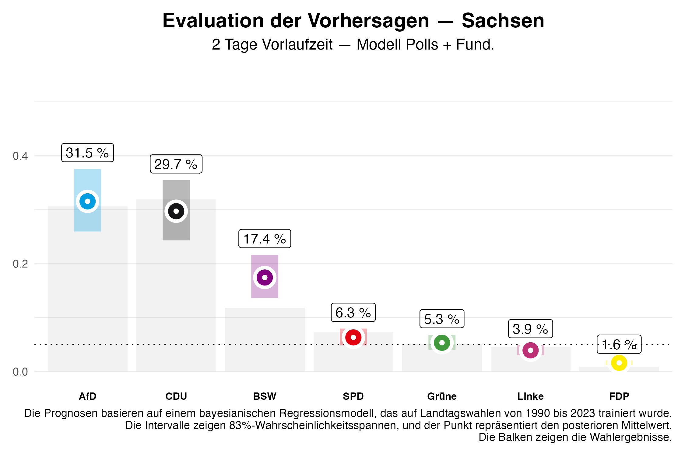
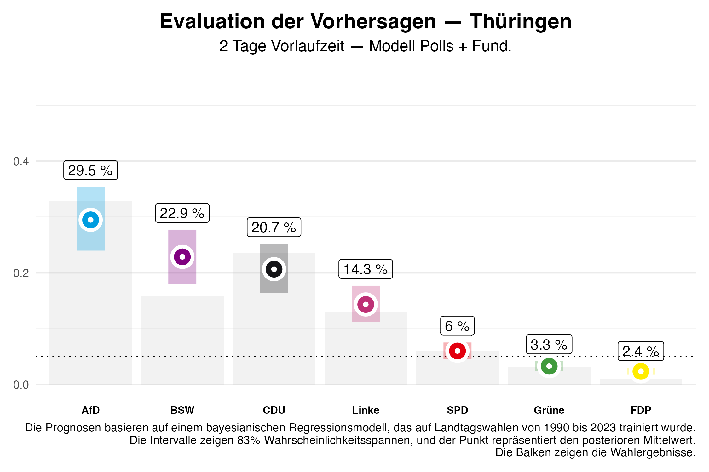
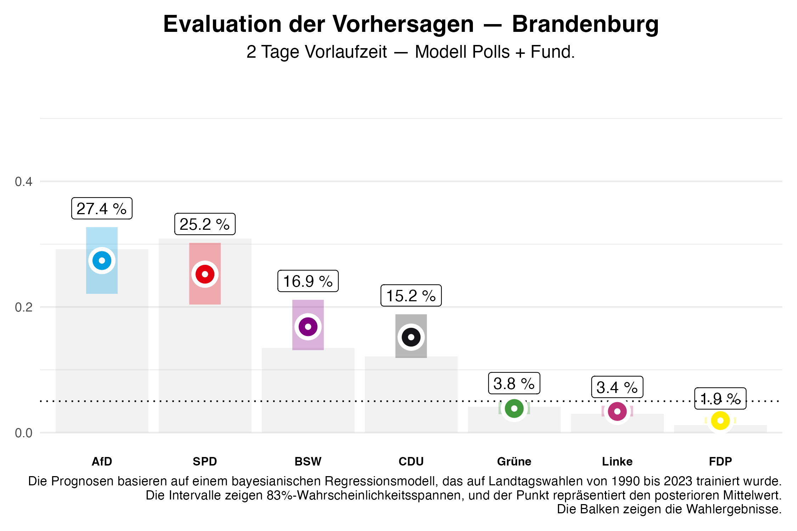

In diesem Beitrag evaluieren wir die auf unserer Seite veröffentlichten Vorhersagen für die Landtagswahlen in Sachsen, Thüringen und Brandenburg und vergleichen diese mit den tatsächlich erzielten Wahlergebnissen. Dabei bezieht sich der folgende Text auf die Vorhersagen die zwei Tage vor den Wahlen veröffentlicht wurden.

# Evaluation der Vorhersagen

## Sachsen

Das Kopf-an-Kopf-Rennen zwischen der CDU und der AfD in Sachsen konnte die CDU knapp für sich gewinnen. Mit **31,9%** liegt der Wahlanteil der Partei **2,2%** oberhalb des zwei Tage vor der Wahl prognostizierten Wertes und damit innerhalb des Kredibilitätsintervall (von **24,3%** bis **35,5%**). Die AFD konnte sich auf **30,6%** verbessern und unterbietet damit unsere Prognose um **0,9%**.

Das Bündnis Sahra Wagenknecht (BSW) wurde bei der Prognose stark überschätzt: der prognostizierte Wahlanteil von **17,4%** ist mit einem reellen Anteil von **11,8%** weit verfehlt. Dieser befindet sich auch nicht innerhalb des 5/6-Kredibilitätsintervall, das zwei Tage vor der Wahl aufgestellt wurde (von **13,6%** bis **21,6%**). 
SPD (**7,3%**) und Grüne (**5,1%**) ziehen beide in den Landtag ein. Die Prognosen entsprachen mit kleineren Abweichungen den Direktstimmenanteilen (Prognose SPD:  **6,3%**, Abweichung 1,0%; Prognose Grüne **5,3%**, Abweichung 0,2%). Die Linke schafft mit **4,5%** der Stimmen den Einzug in den Landtag durch Direktmandate. Dabei übertrifft der Wahlanteil die Prognose um **0,6%** (Intervall: **3,0% bis 4,9%**). Wie prognostiziert hat die FDP den Einzug in den Landtag verfehlt. 

Eine Parlamentsmehrheit für die amtierende CDU-SPD-Grünen-Regierung konnte durch den, vor der Wahl unsicheren, Parlamentseinzug der Grünen erreicht werden. Die Wahrscheinlichkeit für eine Mehrheit wurde von uns vor der Wahl nur mit **7%** eingeschätzt. Eine von uns mit **78%** als wahrscheinlich eingeschätzte Regierungsmehrheit von CDU und BSW ist aufgrund der niedrigeren Stimmanteil des BSW nicht möglich. Eine Mehrheit wäre nur unter Hinzunahme der SPD oder der Grünen zu erreichen.

## Thüringen

Wie mit einer Wahrscheinlichkeit von **88%** von uns erwartet wird die AfD mit **32,8%** der Stimmen stärkste Kraft und übertrifft damit die Prognose um **3,3%**. Damit liegt das endgültige Ergebnis auch innerhalb des Kredibilitätsintervall (zwischen **23,9%** und **35,4%**). 
Die CDU hat **23,6%** der Stimmen erreicht und übertrifft damit die Prognose von **20,7%** (Intervall von **16,5%** bis **25,2%**) und wird zweitstärkste Kraft.

Die Linke verlieren deutlich an Zustimmung und rutschen auf **13,1%**, **1,2%** weniger als prognostiziert. 
So wie in Sachsen wurde das BSW bezogen auf den Stimmenanteil überschätzt: **15,8%** der Stimmen stehen gegen **22,9%** geschätzte Stimmanteile. Damit liegt das Ergebnis wie in Sachsen außerhalb des Kredibilitätsintervalls (von **18,0% bis 27,7%**). 
Die Wahlergebnisse von SPD (**6,1%**) und Grüne (**3,2%**) weichen nur gering von der Prognose ab (Prognose SPD:  **6,0%**, Abweichung 0,1%; Prognose Grüne **3,3%**, Abweichung 0,1%). Damit verfehlen Grüne und auch die FDP, die mit **1,1%** der Stimmanteile die Prognose mit **2,4%**  nochmal stark unterbietet und sogar außerhalb des Kredibilitätsintervalls fällt (Intervall: 1,8% bis 3,0%), die Fünf-Prozent-Hürde.

Mit diesem Ergebnis wird es schwierig, eine Mehrheitsregierung zu organisieren, die ohne Beteiligung der AfD auskommt. Einzig ein Bündnis aus CDU, BSW und Linken würde eine Mehrheit bilden. Damit kann die bisherige Minderheitsregierung aus Linken, SPD und Grünen keine Mehrheitskonstellation darstellen. 
Eine Koalition zwischen der CDU, dem BSW und der SPD, deren Chance auf eine parlamentarische Mehrheit von uns mit **67%** eingeschätzt wurde, erreicht nur knapp keine parlamentarische Mehrheit.

## Brandenburg

In Brandenburg zeigte sich der prognostizierte Zweikampf zwischen AfD und SPD, den die SPD schlussendlich mit **30,9%** zu **29,2%** Stimmanteilen für sich gewinnen konnte und damit stärkste Kraft in Brandenburg bleibt. Damit wurden die Stimmanteile beider Parteien von unserer Prognose unterschätzt, wobei der Anteil der SPD sogar knapp außerhalb des Kredibilitätsintervalls verortet ist (Prognose SPD:  **25,2%**, Abweichung 5,7%; Prognose AfD **27,4%**, Abweichung 1,8%). Vor der Wahl bezifferten wir die Wahrscheinlichkeit für die SPD als stärkste Kraft mit **35%** und schätzten die AfD als stärkste Kraft mit **64%** ein.

Wie in den beiden anderen Bundesländern wurde das BSW auch in Brandenburg überschätzt wobei der Stimmanteil von **13,5%** noch innerhalb unseres Kredibilitätsintervall liegt (Prognose BSW **16,9%**, Abweichung 3,4%, Intervall zwischen 13,1% bis 21,1%). Auch die CDU wurde von uns um 3,1% überschätzt und liegt bei **12,1%** Stimmanteil. Die Grünen, die Linke und die FDP schaffen es nicht über die Fünf-Prozent-Hürde, wobei das Ergebnis der FDP mit **0,8%** noch einmal deutlich schlechter ist als der prognostizierte Anteil (FDP **1,9%**, Abweichung 1,1%).

Damit ist die amtierende Koalition abgewählt. Eine Regierungsbildung ohne Zunahme der AfD ist aus SPD, BSW und CDU, sowie als große Koalition und SPD und BSW möglich.

# Fazit

Unsere Prognosen haben bei den Landtagswahlen insgesamt eine solide Trefferquote erreicht, insbesondere bei den etablierten Parteien wie CDU, SPD, AfD und Grünen. Allerdings zeigt sich in allen drei Bundesländern eine systematische Überschätzung des Bündnisses Sahra Wagenknecht (BSW). Der tatsächliche Stimmenanteil des BSW lag stets deutlich unter der Prognose und in Sachsen und Thüringen sogar außerhalb des Kredibilitätsintervalls. 

---

