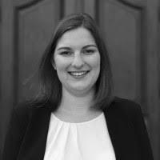

Wir sind ein Team von Wahlforscher:innen der Universität Mannheim, der LMU München, der Hertie School Berlin und der Universität Witten/Herdecke.

Unser Ziel ist es, einem breiten Publikum mithilfe unseres statistischen Modells Informationen und Prognosen zur Bundestagswahl an die Hand zu geben, die über die Momentaufnahmen der politischen Stimmung durch Meinungsumfragen (bspw. „Sonntagsfragen“) hinausgehen.

### Thomas Gschwend

<table class="fixed">
	<col width=50% />
     <col width=50% />
  <tr>
    <td> </td>
    <td>Thomas Gschwend ist Professor am Fachbereich für Politikwissenschaft der Universität Mannheim. Seine Forschungsinteressen liegen in den Bereichen Wahlprognose, vergleichendes politisches Verhalten und Justizpolitik.</td>
   </tr> 
</table>

### Simon Munzert

<table class="fixed">
	<col width=50% />
     <col width=50% />
  <tr>
  	<td>Simon Munzert ist Professor of Data Science and Public Policy an der Hertie School. Zu seinen Forschungsinteressen gehören Meinungsbildung im digitalen Zeitalter, öffentliche Meinung und die Nutzung von Online-Daten in der Sozialforschung.</td>
    <td> </td>
   </tr> 
</table>

### Lukas F. Stoetzer

<table class="fixed">
	<col width=50% />
     <col width=50% />
  <tr>
  	<td> </td>
  	<td>Lukas F. Stoetzer ist Professor für Quantitative Methoden am Fachbereich Wirtschaft und Gesellschaft der Universität Witten/Herdecke. Seine Forschungsinteressen liegen im Bereich des vergleichenden politischen Verhaltens und der politischen Methodologie.</td>
   </tr> 
</table>

### Cornelius Erfort

<table class="fixed">
  <col width=50% />
     <col width=50% />
  <tr>
    <td>Cornelius Erfort ist wissenschaftlicher Mitarbeiter im DFG Projekt "Wahlprognosen für die Bundestagswahl 2025" an der Universität Witten/Herdecke. Seine Forschungsinteressen liegen in den Bereichen politischen Wettbewerb und vergleichendes politisches Verhalten.</td>
    <td> </td>
   </tr> 
</table>

### Hannah Rajski

<table class="fixed">
  <col width=50% />
     <col width=50% />
  <tr>
    <td> </td>
    <td>Hannah Rajski promoviert im Rahmen des DFG Projekts "Wahlprognosen für die Bundestagswahl 2025" an der Universität Mannheim zu Bürgervorhersagen.  </td>
   </tr> 
</table>

### Elias Koch

<table class="fixed">
  <col width=50% />
     <col width=50% />
  <tr>
    <td>Elias Koch promoviert im Rahmen des DFG Projekts "Wahlprognosen für die Bundestagswahl 2025" an der Hertie School.</td>
    <td> </td>
   </tr> 
</table>

## Assoziierte und ehemalige Mitglieder

### Marcel Neunhoeffer

<table class="fixed">
  <col width=50% />
     <col width=50% />
  <tr>
    <td> </td>
    <td>Marcel Neunhoeffer ist wissenschaftlicher Mitarbeiter am Arbeitsbereich Statistische Methoden des Instituts für Arbeitsmarkt- und Berufsforschung in Nürnberg und am Lehrstuhl für Statistik und Datenwissenschaft in den Sozial- und Geisteswissenschaften an der Ludwig-Maximilians-Universität München. In seiner Forschung konzentriert er sich auf die Anwendung von Deep-Learning-Algorithmen auf sozialwissenschaftliche Fragestellungen mit einem Schwerpunkt auf Datenschutz.</td>
   </tr> 
</table>

### Klara Müller

<table class="fixed">
  <col width=50% />
     <col width=50% />
  <tr>
    <td>Klara Müller ist assoziiertes Mitglied am Promotionszentrum für Sozial- und Verhaltenswissenschaften an der GESS, Universität Mannheim. Ihre Forschungsinteressen liegen im Bereich der politischen Psychologie und der Wahlprognose.</td> 
    <td> </td>
   </tr> 
</table>
