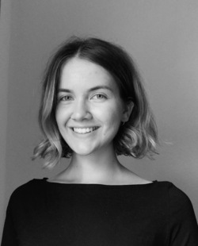

Wir sind ein Team von Wahlforscher:innen der Universität Mannheim, der LMU München, der Hertie School Berlin und der HU Berlin.

Unser Ziel ist es, einem breiten Publikum mithilfe unseres statistischen Modells Informationen und Prognosen zur Bundestagswahl an die Hand zu geben, die über die Momentaufnahmen der politischen Stimmung durch Meinungsumfragen (bspw. „Sonntagsfragen“) hinausgehen.

### Thomas Gschwend

<table class="fixed">
	<col width=50% />
     <col width=50% />
  <tr>
    <td> </td>
    <td>Thomas Gschwend ist Professor am Fachbereich für Politikwissenschaft der Universität Mannheim. Seine Forschungsinteressen liegen in den Bereichen Wahlprognose, vergleichendes politisches Verhalten und Justizpolitik.</td>
   </tr> 
</table>

### Klara Müller

<table class="fixed">
	<col width=50% />
     <col width=50% />
  <tr>
  	<td>Klara Müller ist assoziiertes Mitglied am Promotionszentrum für Sozial- und Verhaltenswissenschaften an der GESS, Universität Mannheim. Ihre Forschungsinteressen liegen im Bereich der politischen Psychologie und der Wahlprognose.</td>
    <td> </td>
   </tr> 
</table>

### Simon Munzert

<table class="fixed">
	<col width=50% />
     <col width=50% />
  <tr>
  	<td> </td>
  	<td>Simon Munzert ist Assistenzprofessor für Data Science and Public Policy an der Hertie School und Mitglied des Hertie School Data Science Lab. Zu seinen Forschungsinteressen gehören Meinungsbildung im digitalen Zeitalter, öffentliche Meinung und die Nutzung von Online-Daten in der Sozialforschung.</td>
    
   </tr> 
</table>

### Marcel Neunhoeffer

<table class="fixed">
	<col width=50% />
     <col width=50% />
  <tr>
  	<td>Marcel Neunhoeffer ist wissenschaftlicher Mitarbeiter am Lehrstuhl für Statistik und Data Science für die Sozial- und Geisteswissenschaften an der Ludwig-Maximilians-Universität München. In seiner Forschung konzentriert er sich auf die Anwendung von Deep-Learning-Algorithmen auf sozialwissenschaftliche Fragestellungen mit einem Schwerpunkt auf Datenschutz.</td>
    <td> </td>
   </tr> 
</table>

### Lukas F. Stoetzer

<table class="fixed">
	<col width=50% />
     <col width=50% />
  <tr>
  	<td> </td>
  	<td>Lukas F. Stoetzer ist Post-Doc am Institut für Sozialwissenschaften der Humboldt-Universität zu Berlin. Seine Forschungsinteressen liegen im Bereich des vergleichenden politischen Verhaltens und der politischen Methodologie.</td>
    
   </tr> 
</table>

