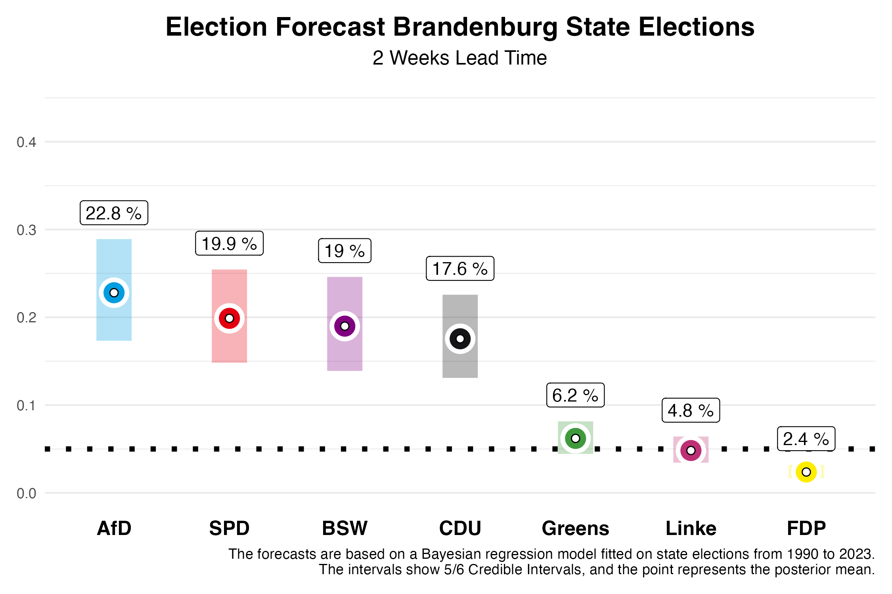
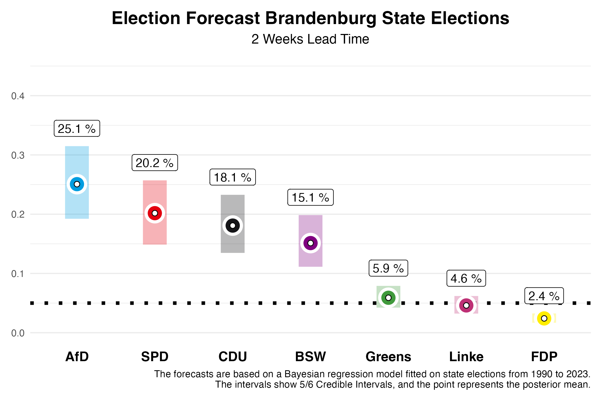

In two weeks, German state elections will be held in Brandenburg. We at Zweitstimme have now developed a forecasting model for state elections and are pleased to present our forecasts on this page, two weeks ahead of the elections -- as we did for Saxony and Thuringia.

# The Forecast

## Brandenburg

In Brandenburg, our current forecast shows a **tight race** between four parties; AfD, SPD, BSW, and CDU, all polling around 20%. For the **SPD**, which was the largest party in the last election, we expect **19.9%** of the votes. However, our forecast two weeks before the election still allows for a 5/6 probability that this value will fall within the credibility interval of **14.8%** to **25.4%**. The **AfD**, on the other hand, is expected to significantly improve, and in our estimation, it might narrowly surpass the SPD with **22.8%**. However, this interval also ranges from **17.1%** to **28.9%**.

The newly founded Bündnis Sahra Wagenknecht (BSW) could achieve a strong result in Brandenburg with **19.0%**, with a 5/6 credibility interval between **13.9%** and **24.6%**. The **CDU** is expected to settle at **17.6%** (interval: **13.1% to 22.6%**), while the **Greens**, who performed relatively well in 2019 with **10.8%**, are now projected to reach **6.2%** (interval: **4.4% to 8.1%**). **Die Linke**, which won **10.7%** of the vote in the last election, might only garner **4.8%** this time (interval: **3.4% to 6.4%**). The **FDP**, which narrowly missed the threshold in 2019 with **2.4%**, is projected to receive **2.4%** again (interval: **1.7% to 3.2%**) and will likely fail to enter the state parliament once more. The remaining vote shares are allocated to “other” parties, which are not shown in the figures.

What does this mean for Brandenburg's future political landscape? Our forecast allows us to calculate probabilities for certain outcomes. The likelihood that the SPD will again become the largest party is **21.6%**, though forming a majority without the AfD could prove challenging, as the AfD is expected to be the largest party with a **52.8%** probability. The probability of a majority for the incumbent coalition of SPD, CDU, and Greens is **39.1%**. One factor contributing to this is that the Greens are predicted to enter the state parliament with an **81%** probability. For **Die Linke**, the probability is **40.5%**. A majority coalition of all parties without AfD and BSW has a **64.5%** probability.

# The Forecast Model

Our forecasts are based on a Bayesian regression model, which we estimate using data from all state elections since 1990 and then use to predict the upcoming state elections. For the forecast, we use information about the parties' participation in government, whether a party holds the office of Minister-President, whether a party is running for state elections for the first time, the party's last election result, the party's average deviation in nationwide polls from the last federal election result, and the average support in the polls published before the state election by various polling institutes. The polls in the state have the greatest influence on the forecast.

How well does our model work? We have evaluated the model based on state elections since 2010 and used it to predict these state elections as a test, using only data available before the respective state elections. On average, the absolute deviation from the final result two weeks before the election is **2.19 percentage points**. This means that a lot can still happen in the next two weeks. If we make the forecast two days before the election, on Friday 30th of August, the forecast becomes more accurate, and we are much closer to the final result with an average absolute deviation of **1.46 percentage points**.

## Model Based on Polls Only

In previous blog posts, we published our forecasts for the state elections in Saxony and Thuringia on September 1, 2024. Our full model accounted for the BSW as a new party and made corresponding predictions. Compared to the final results, this led to an overestimation of BSW's vote share. Therefore, for the Brandenburg election, we are also presenting forecasts from a model that is based solely on polling and does not give special consideration to new parties. If BSW does not significantly outperform the polls in Brandenburg, this prediction may be closer to the final result.

