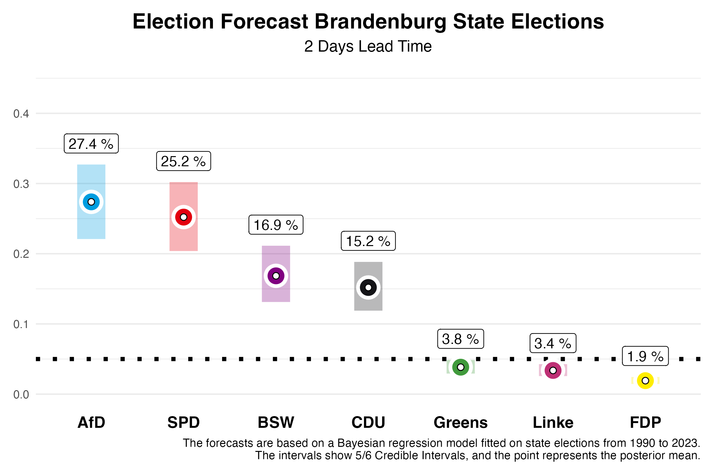
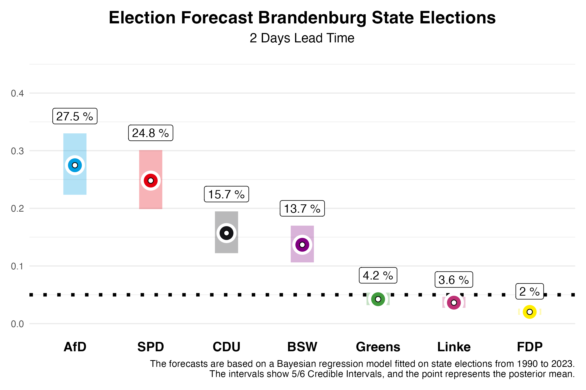

Two weeks ago, we published forecasts for the state election in Brandenburg. Today, two days before the election, we are updating these forecasts using our prediction model, based on the polls published in the meantime. Based on previous state elections from 2010 to 2023, we know that our forecasts two days before the election are already very accurate. We have an average absolute deviation of 1.46 percentage points across all parties, which is very close to the final result.

# Die Vorhersage

## Brandenburg

In Brandenburg, our current forecast shows that the AfD and SPD have clearly pulled ahead of the BSW and CDU. For the **SPD**, which was the largest party in the last election, we expect **25.2%** of the votes. However, our forecast two days before the election still allows for a 5/6 probability that this value will fall within the credibility interval of **20.4%** to **30.2%**. The **AfD**, on the other hand, is expected to significantly improve and, in our estimation, might narrowly surpass the SPD with **27.4%**. However, this interval also ranges from **22.1%** to **32.7%**.

The newly founded Bündnis Sahra Wagenknecht (BSW) could achieve a strong result in Brandenburg with **16.9%**, with a 5/6 credibility interval between **13.1%** and **21.1%** — although this is significantly lower than what was predicted two weeks ago. The **CDU** is expected to settle at **15.2%** (interval: **11.9% to 18.8%**), while the **Greens**, who performed relatively well in 2019 with **10.8%**, are now projected to reach **3.8%** (interval: **2.9% to 4.9%**). **Die Linke**, which won **10.7%** of the vote in the last election, might only garner **3.4%** this time (interval: **2.6% to 4.3%**). The **FDP**, which missed the threshold in 2019 with **2.4%**, is projected to receive **1.9%** again (interval: **1.4% to 2.4%**) and will likely fail to enter the state parliament once more. The remaining vote shares are allocated to “other” parties, which are not shown in the figures.

What does this mean for Brandenburg's future political landscape? Our forecast allows us to calculate probabilities for certain outcomes. The probability that the SPD will again become the largest party is **35%**, though forming a majority without the AfD could prove challenging, as the AfD is expected to be the largest party with a **64%** probability. There is a **0%** probability for BSW and the **CDU** to become the largest party. The probability of a majority for the incumbent coalition of SPD, CDU, and Greens is **4%**. One factor contributing to this is that the Greens are predicted to enter the state parliament with a **7%** probability. For **Die Linke**, the probability to enter is **2%**. A majority coalition of all parties without AfD and BSW has a **31%** probability. However, note that parties may also enter the parliament in Brandenburg if they win at least one district. This possibility was not taken into account for the calculation of proabilities.

# The Forecast Model

At the Congress of the German Association for Political Science 2024, from September 24th to 27th in Göttingen, we will present a research paper on our forecast model for state elections. Our predictions are based on a Bayesian regression model that we estimate using data from all state elections since 1990, and then use to forecast the upcoming state elections. For forecasting, we use information on the parties' participation in government, whether a party holds the position of Prime Minister, whether a party is new to the state elections, the party's last election result, the average deviation of the party in national polls from the last federal election result, and the average support in the polls published by various polling institutes before the state election. The state-specific polls have the greatest influence on our forecasts.

## Model Based on Polls Only

In previous blog posts, we published our forecasts for the state elections in Saxony and Thuringia on September 1, 2024. Our full model accounted for the BSW as a new party and made corresponding predictions. Compared to the final results, this led to an overestimation of BSW's vote share. Therefore, for the Brandenburg election, we are also presenting forecasts from a model that is based solely on polling and does not give special consideration to new parties. If BSW does not significantly outperform the polls in Brandenburg, this prediction may be closer to the final result.
