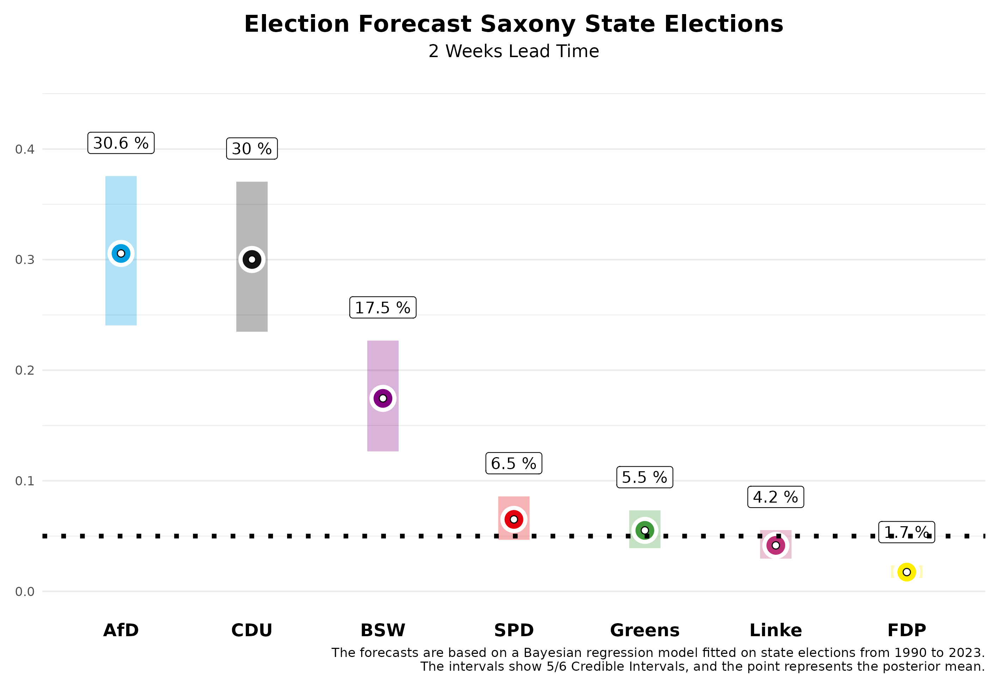
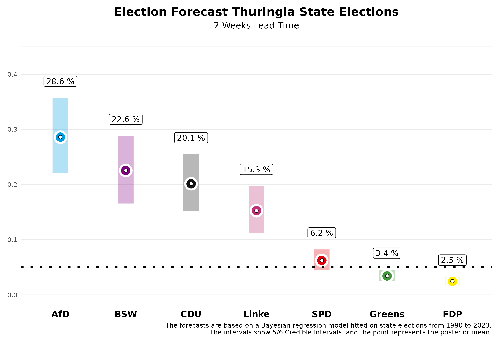

In two weeks, German state elections will be held in Saxony and Thuringia. We at Zweitstimme have now developed a forecasting model for state elections and are pleased to present our forecasts on this page, two weeks ahead of the elections.

# The Forecast

## Saxony

In Saxony, our current forecast shows a close race between the CDU and the AfD. For the CDU, which was the largest party in the last election, we expect **30.0%** of the votes. However, our forecast two weeks before the election still allows for a 5/6 probability that this value will fall within the credibility interval of **23.5%** to **37.0%**. The AfD, on the other hand, is expected to significantly improve, and in our estimation, it might narrowly surpass the CDU with **30.6%**. However, this interval also ranges from **24.0%** to **37.6%**.

The newly founded Bündnis Sarah Wagenknecht (BSW) could achieve a strong result with **17.5%**, with a 5/6 credibility interval between **12.7%** and **22.7%**. The SPD is expected to stabilize at a low level, with an expected vote share of **6.5%** (interval: **4.7% to 8.6%**), along with the Greens at **5.5%** (interval: **3.9% to 7.3%**) and Die Linke at **4.2%** (interval: **3.0% to 5.5%**). The FDP is expected to clearly miss the entry into the state parliament with **1.7%** (interval: **1.2% to 2.4%**).

What does this mean for the future political landscape in Saxony? Our forecast allows us to calculate probabilities for certain events. The probability that the CDU will become the strongest party is **47.8%**. However, it will be difficult to form a majority government for the CDU without the AfD. The probability that there will be a majority for the incumbent CDU-SPD-Greens government is rather low at **13.3%**. This is also due to the fact that the Greens are only expected to enter the state parliament with a probability of **62.6%**. A government majority for the CDU without the AfD is most likely with the BSW (**74.5%**), especially with the addition of the SPD (**84.4%**).

## Thuringia

In Thuringia, the AfD now dominates the political landscape, and we expect it to emerge as the strongest force with **28.6%** of the vote. However, two weeks before the election, there is still a lot of room for variation in our forecast, with the 5/6 credibility interval ranging from **22.0%** to **35.7%**. Die Linke, despite its prime minister Ramelow, is expected to lose significant support. Two weeks before the election, we expect only **15.3%** (interval: **11.3% to 19.7%**). The CDU, which also performed well in the last election, could now reach around **20.1%**, with the interval ranging from **15.2%** to **25.5%**.

The Bündnis Sarah Wagenknecht (BSW) could achieve a surprising success with **22.6%** and enter the state parliament directly as the second strongest party (interval: **16.6% to 28.9%**). The Greens are likely to remain in the lower range with **3.4%** (interval: **2.4% to 4.6%**) and the SPD with **6.2%** (interval: **4.5% to 8.2%**). The FDP also has little chance of surpassing the five percent hurdle in Thuringia with **2.5%** (interval: **1.7% to 3.3%**).

Our forecasting model also allows us to specify probabilities for concrete events in Thuringia. The AfD is likely to become the strongest party in the state parliament with a probability of **77.7%**. Since most parties have ruled out participating in a government with the AfD, it will be difficult to organize majorities. It is already clear that the previous minority government of Die Linke, SPD, and Greens will no longer be a majority constellation; the probability for this is **0%**. Instead, other alliances are possible but not necessarily politically desired. A coalition between the CDU, BSW, and SPD has a **59.9%** probability of achieving a parliamentary majority, while an alliance of BSW, Die Linke, and SPD has a **23.4%** probability.

# The Forecast Model

Our forecasts are based on a Bayesian regression model, which we estimate using data from all state elections since 1990 and then use to predict the upcoming state elections. For the forecast, we use information about the parties' participation in government, whether a party holds the office of Minister-President, whether a party is running for state elections for the first time, the party's last election result, the party's average deviation in nationwide polls from the last federal election result, and the average support in the polls published before the state election by various polling institutes. The polls in the state have the greatest influence on the forecast.

How well does our model work? We have evaluated the model based on state elections since 2010 and used it to predict these state elections as a test, using only data available before the respective state elections. On average, the absolute deviation from the final result two weeks before the election is **2.19 percentage points**. This means that a lot can still happen in the next two weeks. If we make the forecast two days before the election, on Friday 30th of August, the forecast becomes more accurate, and we are much closer to the final result with an average absolute deviation of **1.46 percentage points**.
