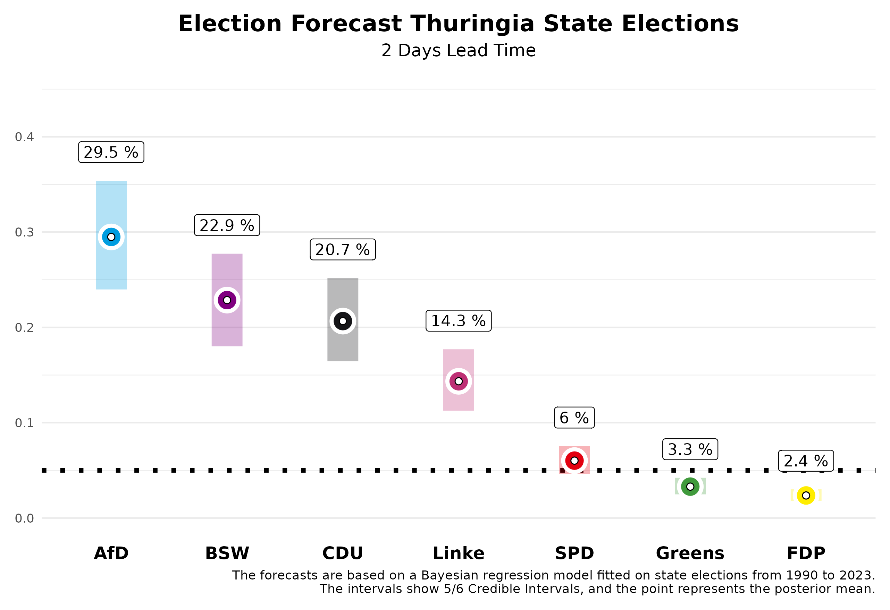

Two weeks ago, we published forecasts for the state elections in Saxony and Thuringia. Today, two days before the election, we are updating these forecasts using our prediction model, based on the polls published in the meantime for Saxony and Thuringia. Based on previous state elections from 2010 to 2023, we know that our forecasts two days before the election are already very accurate. We have an average absolute deviation of 1.46 percentage points across all parties, which is very close to the final result.

# The Forecast

## Saxony

In Saxony, the neck-and-neck race between the CDU and the AfD continues. We expect the CDU to receive **29.7%** of the votes, with our forecast two days before the election allowing a 5/6 probability that this value will lie within the credibility interval between **24.3%** and **35.5%**. The AfD is expected to make significant gains and, in our projections, narrowly surpasses the CDU with **31.5%**. However, this interval also ranges from **25.9%** to **37.6%**. This results in a **62.8%** probability that the AfD will become the strongest force.

The newly founded Sahra Wagenknecht Alliance (BSW) is certain to enter the state parliament; we expect **17.4%** (5/6 credibility interval between **13.6%** and **21.6%**). For the SPD, we expect a vote share of **6.3%** (interval: **4.8% to 8.0%**). For the Greens, it will be close whether they enter the state parliament, with an expected share of **5.3%** (interval: **4.1% to 6.8%**). The probability of this happening is **60%**. The chances for the Left are slim, at **3.9%** (interval: **3.0% to 4.9%**). The FDP is also expected to miss the threshold to enter the state parliament with **1.6%** (interval: **1.2% to 2.1%**). The remaining vote shares go to "other" parties, which are not shown in the figures.

What does this mean for potential government formation? The likelihood of a parliamentary majority for the incumbent CDU-SPD-Greens government is relatively low at **7%**, partly due to the uncertain probability of the Greens entering the parliament. A majority for the CDU without the AfD is most likely with the BSW (**78%**), especially with the inclusion of the SPD (**88%**).

## Thuringia

In Thuringia, the AfD is expected to become the strongest force with an **88%** probability. We anticipate they will receive **29.5%** of the votes. However, two days before the election, there is still room for variability in our forecast; the 5/6 credibility interval ranges between **23.9%** and **35.4%**. We expect the Left to lose significant support, with **14.3%** (interval: **11.3% to 17.7%**). The CDU could reach around **20.7%**, with the interval ranging from **16.5%** to **25.2%**.

The Sahra Wagenknecht Alliance (BSW) could achieve a surprising success with **22.9%**, entering the state parliament as a strong party (interval: **18.0% to 27.7%**). The Greens are likely to remain in the lower range with **3.3%** (interval: **2.5% to 4.2%**), and the SPD with **6.0%** (interval: **4.6% to 7.5%**). The FDP also has little chance of overcoming the five-percent threshold in Thuringia, with **2.4%** (interval: **1.8% to 3.0%**).

With this outcome, it will be challenging to form a majority government that excludes the AfD. It is already clear that the previous minority government of the Left, SPD, and Greens no longer represents a majority; the probability for this is 0%. Instead, other coalitions are possible, though not necessarily politically desired. A coalition between the CDU, BSW, and SPD has a **67%** probability of achieving a parliamentary majority, while a coalition of BSW, the Left, and SPD has a **13%** chance of securing a majority. Therefore, the political situation will remain interesting even after the election.

# The Forecast Model

At the Congress of the German Association for Political Science 2024, from September 24th to 27th in Göttingen, we will present a research paper on our forecast model for state elections. Our predictions are based on a Bayesian regression model that we estimate using data from all state elections since 1990, and then use to forecast the upcoming state elections. For forecasting, we use information on the parties' participation in government, whether a party holds the position of Prime Minister, whether a party is new to the state elections, the party's last election result, the average deviation of the party in national polls from the last federal election result, and the average support in the polls published by various polling institutes before the state election. The state-specific polls have the greatest influence on our forecasts.
