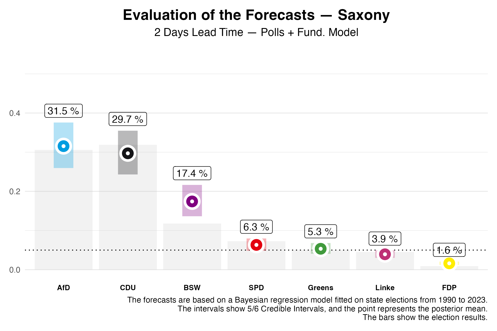
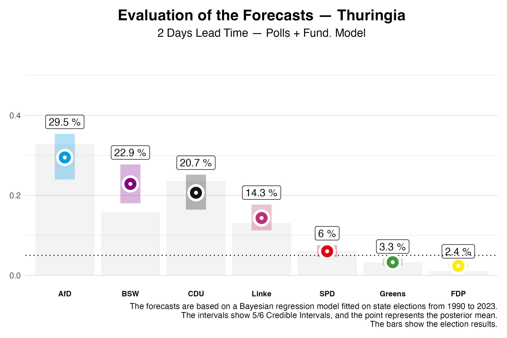
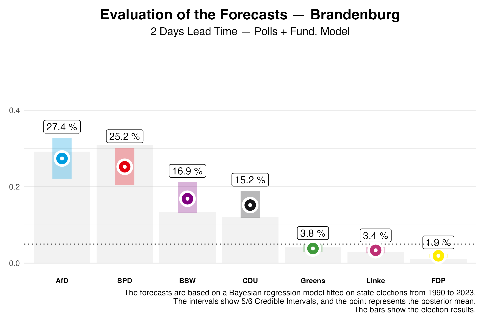

In this post, we evaluate the forecasts for the state elections in Saxony, Thuringia, and Brandenburg, which were published on our website, and compare them with the actual election results. The following text refers to the predictions that were published two days before the elections.

# Evaluation of the Forecasts

## Saxony

The close race between the CDU and AfD in Saxony was narrowly won by the CDU. With **31.9%**, the party’s vote share is **2.2%** higher than the forecast two days before the election. The AfD improved to **30.6%**, which is **0.9%** lower than our prediction.

The newly-formed Bündnis Sahra Wagenknecht (BSW) was overestimated: the predicted vote share of **17.4%** is significantly higher than the actual result of **11.8%**, and falls outside the 5/6 credibility interval. However, our model accounts for this by expecting that in one out of six cases, the prediction may lie outside this range. 
The SPD (**7.3%**), Greens (**5.1%**), and Left Party (**4.5%**) all entered the parliament. The forecasts closely matched the actual vote shares, with minor deviations (Forecast: SPD **6.3%**, Greens **5.3%**, Left **3.9%**). The Left Party secured its parliamentary entry with **4.5%** due to the basic mandate clause. As predicted, the FDP did not enter the state parliament.

A majority for the incumbent CDU-SPD-Green government was not achieved, despite the unexpected parliamentary entry of the Greens. We had estimated the likelihood of such a majority at only **7%**. A government majority of CDU and BSW, which we estimated at **78%** probability, is unexpectedly not possible due to the lower BSW vote share. A majority could only be achieved with the addition of the SPD or the Greens.

## Thuringia

In Thuringia, the AfD became the strongest party with **32.8%** of the vote, a scenario our model predicted with an **88%** probability. The CDU achieved **23.6%**, exceeding the forecast of **20.7%**, making it the second strongest party. The Left Party lost significant support, dropping to **13.1%**, which is **1.2%** less than predicted. As in Saxony, BSW was overestimated: **15.8%** of the vote compared to the predicted **22.9%**, again outside the credibility interval.
The election results of the SPD (**6.1%**) and Greens (**3.2%**) slightly deviated from the forecast (Prediction: SPD **6.0%**, Greens **3.3%**), with both parties and the FDP missing the 5% threshold.

With these results, forming a majority government without the AfD will be challenging. The only feasible option would be a coalition of CDU, BSW, and the Left Party. This means that the current minority government of Left Party, SPD, and Greens cannot form a majority. A coalition between the CDU, BSW, and SPD, which we had estimated at **67%** probability for a majority, narrowly failed to secure a parliamentary majority.

## Brandenburg

In Brandenburg, the forecasted close race between the AfD and SPD materialized, with the SPD ultimately winning **30.9%** of the vote compared to **29.2%** for the AfD. The SPD remains the strongest party in Brandenburg, even surpassing the 5/6 credibility interval. Before the election, we had estimated the SPD's chances of being the strongest party at **35%**, while the AfD's chances were **64%**.

As in the other states, BSW was overestimated in Brandenburg, though the vote share of **13.5%** remains within the credibility interval. The Greens, Left Party, and FDP did not surpass the 5% threshold.
Thus, the incumbent coalition has been ousted. Forming a government without the AfD would only be possible through a coalition of the SPD and BSW, or by including the SPD. A grand coalition is just barely not achievable.

# Conclusion

Overall, our model provided accurate predictions for the state elections, especially for the established parties like CDU, SPD, AfD, and Greens. However, there was a systematic overestimation of the newly-founded BSW.
