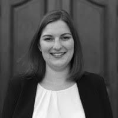
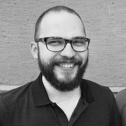

We are a team of election researchers from the University of Mannheim, LMU Munich, the Hertie School Berlin, and the University of Witten/Herdecke.

Our goal is to provide a broad audience with information and forecasts about the Bundestag election using our statistical model, which goes beyond the snapshots of political sentiment provided by opinion polls (e.g., "Sunday Questions").

### Thomas Gschwend

<table class="fixed">
  <col width=50% />
    <col width=50% />
  <tr>
    <td></td>
    <td>Thomas Gschwend is a Professor at the Department of Political Science at the University of Mannheim. His research interests are in the areas of election forecasting, comparative political behavior, and judicial politics.</td>
  </tr> 
</table>

### Simon Munzert

<table class="fixed">
  <col width=50% />
    <col width=50% />
  <tr>
    <td>Simon Munzert is a Professor of Data Science and Public Policy at the Hertie School. His research interests include opinion formation in the digital age, public opinion, and the use of online data in social research.</td>
    <td></td>
  </tr> 
</table>

### Lukas F. Stoetzer

<table class="fixed">
  <col width=50% />
    <col width=50% />
  <tr>
    <td></td>
    <td>Lukas F. Stoetzer is a Professor of Quantitative Methods at the Department of Economy and Society at the University of Witten/Herdecke. His research interests are in the field of comparative political behavior and political methodology.</td>
  </tr> 
</table>

### Cornelius Erfort

<table class="fixed">
  <col width=50% />
    <col width=50% />
  <tr>
    <td>Cornelius Erfort is a research associate in the DFG project "Election Forecasts for the 2025 Bundestag Election" at the University of Witten/Herdecke. His research interests are in the areas of political competition and comparative political behavior.</td>
    <td></td>
  </tr> 
</table>

### Hannah Rajski

<table class="fixed">
  <col width=50% />
    <col width=50% />
  <tr>
    <td></td>
    <td>Hannah Rajski is pursuing a PhD in the DFG project "Election Forecasts for the 2025 Bundestag Election" at the University of Mannheim, focusing on citizen forecasts.</td>
  </tr> 
</table>

### Elias Koch

<table class="fixed">
  <col width=50% />
    <col width=50% />
  <tr>
    <td>Elias Koch is pursuing a PhD in the DFG project "Election Forecasts for the 2025 Bundestag Election" at the Hertie School.</td>
    <td></td>
  </tr> 
</table>

## Associated and Former Members

### Marcel Neunhoeffer

<table class="fixed">
  <col width=50% />
    <col width=50% />
  <tr>
    <td></td>
    <td>Marcel Neunhoeffer is a research associate at the Statistical Methods Unit at the Institute for Employment Research in Nuremberg and at the Chair of Statistics and Data Science in the Social and Humanities at the Ludwig Maximilian University of Munich. His research focuses on the application of deep learning algorithms to social science questions with a focus on data privacy.</td>
  </tr> 
</table>

### Klara Müller

<table class="fixed">
  <col width=50% />
    <col width=50% />
  <tr>
    <td>Klara Müller is an associated member of the PhD Center for Social and Behavioral Sciences at GESS, University of Mannheim. Her research interests are in the field of political psychology and election forecasting.</td> 
    <td></td>
  </tr> 
</table>
