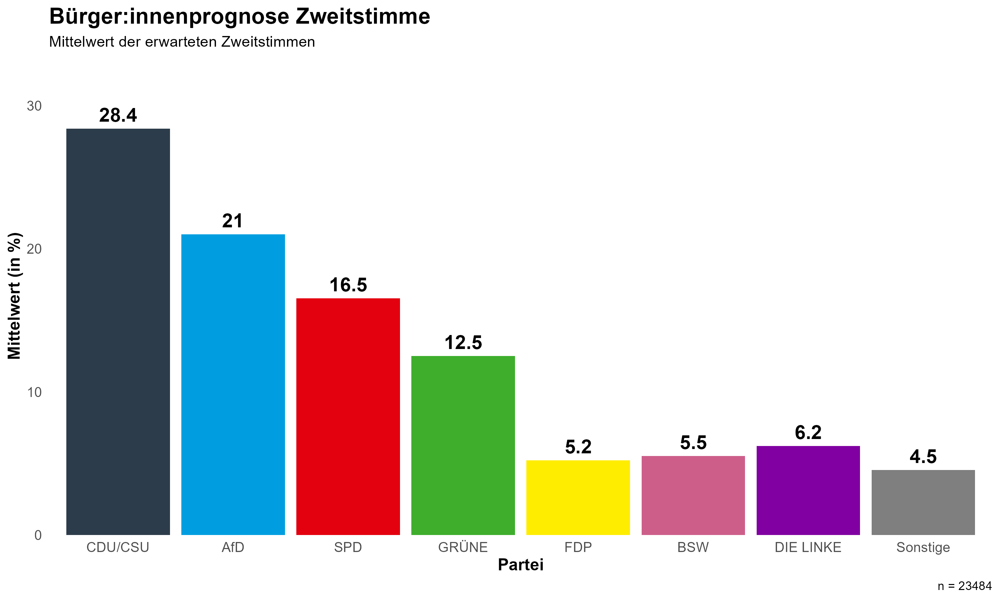
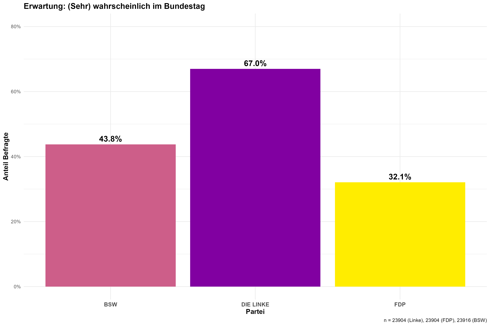
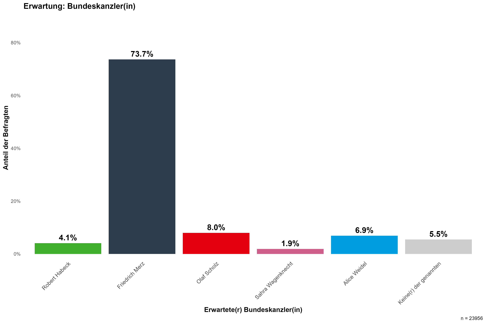
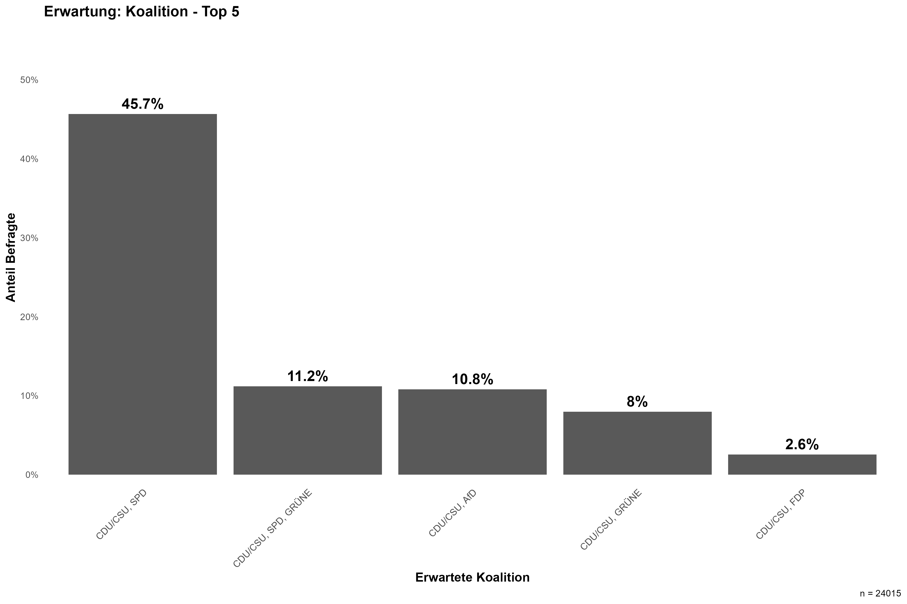

Wir haben über 20.000 Personen gefragt, was sie erwarten wie die Wahl ausgeht - im Gegensatz zu der Frage "Wen werden Sie wählen?". 
Dabei bilden diese Personen keine repräsentative Stichprobe, sie sind entweder Teil eines Online Access Panels oder haben Anzeigen für unsere Arbeit auf facebook oder Instagram gesehen und an unserer Studie teilgenommen. Befragungen fanden zwischen 13. und 20. Februar 2025 statt.

Dieser Ansatz beruht auf der Idee der Bürger:innenprognosen (English: Citizen Forecasts). 
Eine Gruppe von Personen wird zu ihren Erwartungen zum Wahlausgang befragt und die aggregierten Antworten dieser Gruppe werden als Prognose für den Wahlausgang genommen.
Die Idee dahinter ist, dass die Individuen nicht alle richtig liegen, aber die Aggregation der Antworten zu einer besseren Prognose führt, da die einzelnen Fehler sich ausgleichen.
Die Schwarm-Intelligenz der Gruppe wird ausgenutzt.

Im Deutschen Mischwahlsystem gibt es unterschiedliche Aspekte von Ergebnissen, die interessant sind.
So ist zum einen von Interesse, wie viele Zweitstimmen die einzelnen Parteien bekommen.
Zum anderen interessiert auch, welche Person einen Wahlkreis gewinnt.
Und insbesondere mit der neuen Wahlrechtsreform ist auch interessant, wie viel Prozent der Erststimmen die einzelnen Kandidierenden erhalten.
All diese Fragen haben wir Bürger:innen gestellt.

[Arndt Leininger und Kollegen](https://doi.org/10.1007/978-3-658-42694-1_15) haben diesen Vorhersageansatz für die Bundestagswahl 2021 genutzt.

Bei der Frage, wer den Wahlkreis gewinnt, gilt die Person als vorhergesagte:r Gewinner:in, die am häufigsten genannt wurde (mathematisch: der Modus).
2021 wurden auf diese Art und Weise 75\% der Wahlkreisgewinner:innen richtig vorhergesagt.
Bei der Aufteilung der Erststimmen wird in jedem Wahlkreis der Durchschnittswert pro Partei gebildet, um die Bürger:innenprognose zu erstellen. 2021 lag der mittlere absolute Fehler der Wahlkreis-Gruppen bei 3,5 Prozentpunkten.
Die Zweitstimmenprognose wird als Mittelwert der Erwartungen aller Bürger:innen gebildet. Der mittleren absolute Fehler für die bundesweite Zweitstimmenprognose lag 2021 bei 1,4 Prozentpunkten.

***Was erwarten die Bürger:innen für die Bundestagswahl 2025?***

## Zweitstimme

Zunächst wurden Befragte gebeten, ihre Erwartungen zu den Zweitstimmen für jede im Bundestag vertretene Partei und sonstige anzugeben. 
***Wenn Sie zunächst an die Zweitstimmen denken, die über die Verteilung der Mandate im Bundestag entscheiden: Wie viel Prozent der Stimmen erwarten Sie, werden die verschiedenen Parteien bundesweit erhalten?***

Die erste Grafik zeigt die Verteilung der Erwartungen der Bürger:innen für die Zweitstimmenverteilung. 
Die schwarze Linie zeigt den Mittelwert der Erwartungen für jede Partei. 

Dieser Mittelwert entspricht der Bürger:innenprognose für die Zweitstimmen. 

Die zweite Grafik zeigt nur den Mittelwert der Erwartungen für jede Partei, also die Bürger:innenprognose.

## Einzug ins Parlament

Darüberhinaus haben wir für die drei Parteien, die sich in aktuellen Umfragen und Prognosen um die 5 \%-Hürde bewegen, explizit nachgefragt: 
***Um im Bundestag vertreten zu sein, benötigt eine Partei 5 % der Zweitstimmen oder drei Direktmandate. Für wie wahrscheinlich halten Sie es, dass die folgenden Parteien bei der bevorstehenden Bundestagswahl jeweils im Bundestag vertreten sein werden?*** 
Antwortoptionen waren "sehr wahrscheinlich im Bundestag", "wahrscheinlich", "wahrscheinlich nicht" und "sehr wahrscheinlich nicht im Bundestag".

Hier sehen Sie, welcher Anteil an Befragten erwartet, dass das BSW, DIE LINKE oder die FDP sehr wahrscheinlich oder wahrscheinlich in den Bundestag einziehen werden. 

43.8 % der Befragten erwarten, dass das BSW sehr wahrscheinlich oder wahrscheinlich in den Bundestag einzieht. Für Die LINKE sind es 67 % und für die FDP nur 32.1 %

## Erststimme

***Und nun noch zu Ihrer Erwartung im eigenen Wahlkreis: Welcher Kandidat oder welche Kandidatin wird bei der Bundestagswahl in Ihrem Wahlkreis  die meisten Stimmen gewinnen?***

Dort konnten die Befragten die Person auswählen, von der sie erwarten, dass sie den Wahlkreis gewinnt. 
Dabei wird innerhalb eines Wahlkreises die Person mit den meisten Stimmen als Wahlkreisgewinner(in) gewertet.
Die Aggregation passiert also über den Modalwert.

Die Intensität der Farben gibt an, wie viele Befragte die jeweilige Partei als Wahlkreisgewinner(in) erwarten. Je dunkler ein Wahlkreis, desto höher der Anteil an Befragten, die eine(n) Gewinner(in) von der jeweiligen Partei erwarten.

<iframe src="/map_citizen_forecast_winner.html" style="width:100%; height:500px; border:none;"></iframe>

Die Bürger:innen gehen davon aus, dass in 202 Wahlkreisen CDU/CSU den Wahlkreis gewinnen wird. 40 Wahlkreise gehen an die SPD und 40 an die AfD. Die Grünen sind in 10 Wahlkreisen die erwarteten Sieger und DIE LINKE in 4.

In 3 Wahlkreisen gibt es ein Kopf-an-Kopf-Rennen. Das bedeutet, es gibt zwei Kandidierende, bei denen gleich viele Befragte erwarten, dass diese den Wahlkreis gewinnen. Dies ist der Fall in den Wahlkreisen Börde – Salzlandkreis, Harz (CDU/CSU und AfD) und Saarbrücken (CDU/CSU und SPD).

## Bundeskanzler(in)

In der Frage ***Was denken Sie, wer wird nach der Bundestagswahl Bundeskanzler(in)?*** zeichnet sich ein klares Muster ab. Die Mehrheit (73,7 %) erwartet, dass Friedrich Merz von der CDU der neue Kanzler wird. 

## Koalition

***Was erwarten Sie, welche Parteien werden tatsächlich nach der Bundestagswahl zusammen die Regierung bilden?***

Die meist genannte erwartete Koalition ist eine aus CDU/CSU und SPD.

***Bibliographie***
Leininger, A., Murr, A.E., Stoetzer, L.F., Kayser, M.A. (2024). Bürger:innenprognosen in einem Mischwahlsystem: Die deutsche Bundestagswahl 2021 als Testfall. In: Schoen, H., Weßels, B. (eds) Wahlen und Wähler. Springer VS, Wiesbaden. [https://doi.org/10.1007/978-3-658-42694-1_15](https://doi.org/10.1007/978-3-658-42694-1_15)
