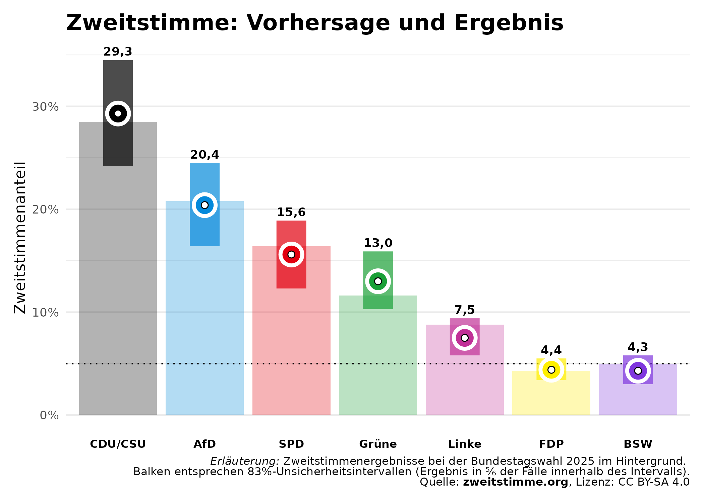
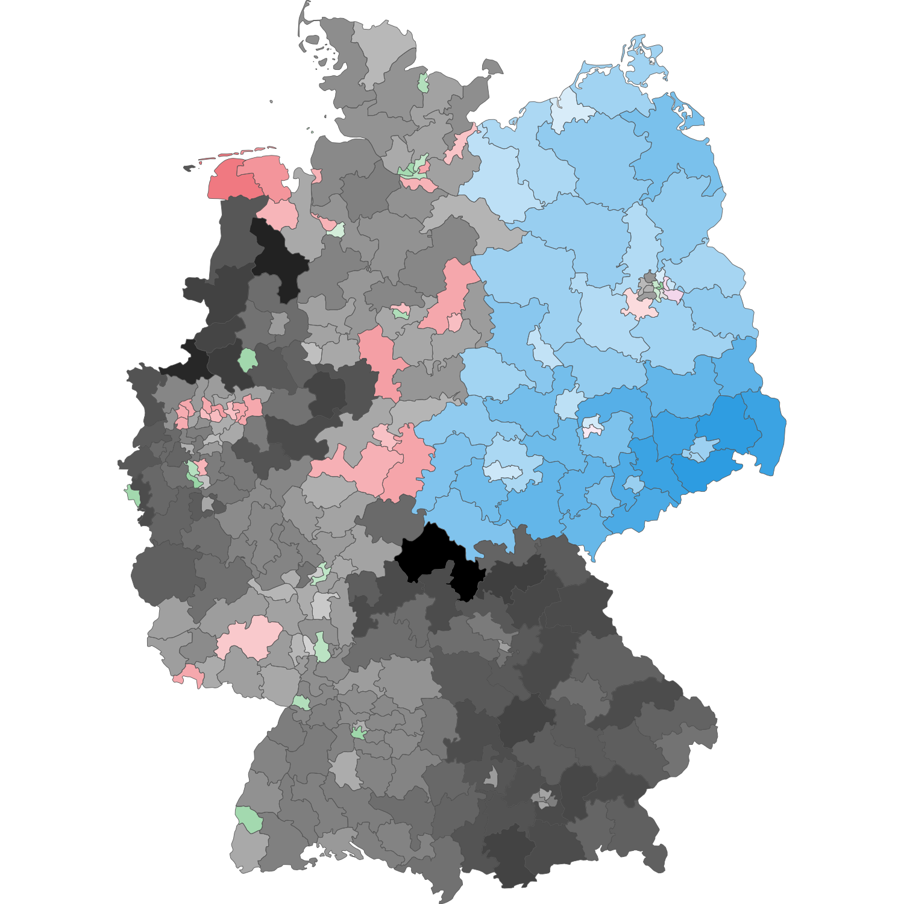
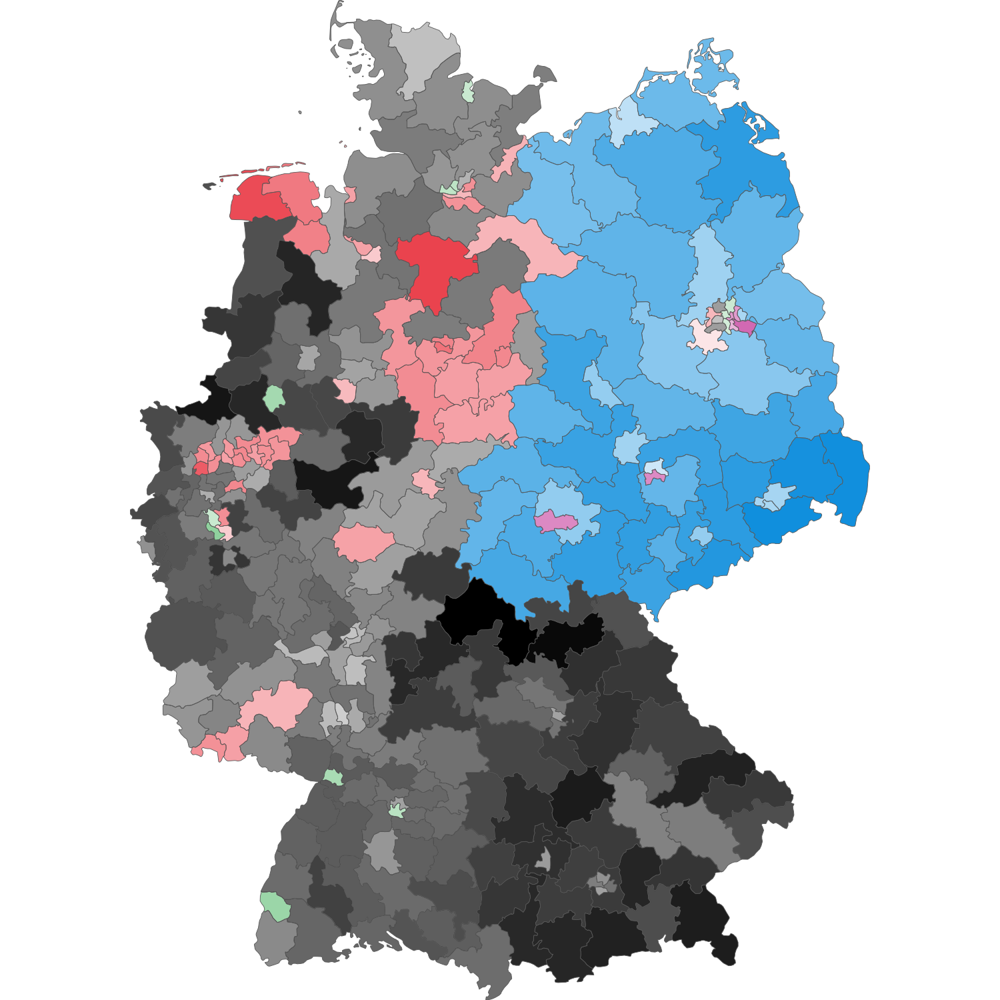
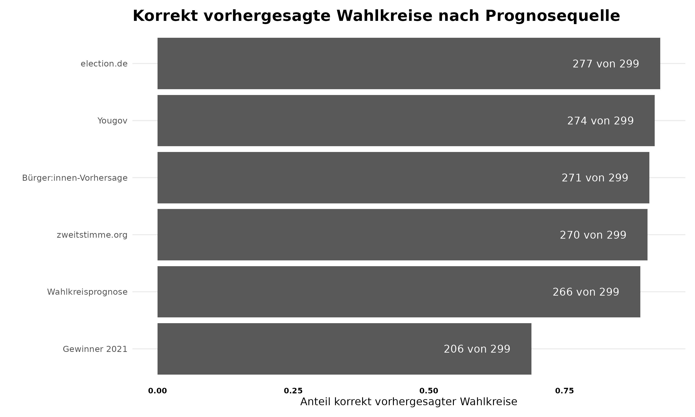

Mit der Veröffentlichung des amtlichen Endergebnisses der Bundestagswahl 2025 ist es an der Zeit, die Leistung unserer Wahlprognosemodelle zu evaluieren.

Diese Bewertung bietet Einblicke in die Genauigkeit der Modelle, die Herausforderungen, denen wir begegnet sind, und die geplanten Verbesserungen für zukünftige Vorhersagen auf [zweitstimme.org](https://zweitstimme.org).

## Überblick
Unser [Zweistimmen-Modell](https://zweitstimme.org/posts/blog/zweitstimme-model/) hat erneut zuverlässige Vorhersagen für die Anteile der Zweitstimmen geliefert. Im Durchschnitt lagen wir mit unserer Zweitstimmenprognose nur um 0,78 absolute Prozentpunkte vom tatsächlichen Ergebnis der Parteien entfernt. Alle Parteien befanden sich innerhalb des von uns angegebenen Unsicherheitsbereichs.

Die Wahlkreisprognose bildet die Tendenz in den Wahlkreisen auch gut ab. Mit unserem [Erststimmen-Modell](https://zweitstimme.org/posts/blog/erststimme-model/) haben wir 270 der 299 Wahlkreise korrekt vorhergesagt und eine Mittlere absolute Abweichung von 2,21 Prozent-Punkten bei den Erstimmenanteilen erreicht. Diese Werte sind besser im Vergleich zur Anwendung unseres Modells bei der [letzten Wahl](https://zweitstimme.org/posts/blog/evaluation/). Auch im Vergleich zu anderen Wahlkreisprognosen schnitt unser Modell gut ab (siehe unten). 

## Zweitstimme

Die CDU/CSU hat wie erwartet die meisten Zweitstimmen bei der Bundestagswahl 2025 erhalten. Mit 28,6 % liegt ihr Zweitstimmenanteil laut vorläufigem Endergebnis um 0,7 Prozentpunkte unter den zwei Tage vor der Wahl von uns prognostizierten 29,3 %. Der Wert befindet sich auch innerhalb des 5/6-Kredibilitätsintervalls.

Die AfD konnte ihren Zweitstimmenanteil ungefähr verdoppeln und erhielt 20,8 % der Zweitstimmen. Unsere Vorhersage von 20,4% wich damit nur um 0,4 Prozentpunkte vom finalen Ergebnis ab.  

Die SPD und die Grünen befinden sich wie erwartet auf Platz drei und vier. Für die SPD haben wir einen Zweitstimmenanteil von 15,6 % vorhergesagt und liegen damit nur um 0,8 Prozentpunkte neben dem vorläufigen Endergebnis von 16,4 %. Auch bei den Grünen liegen wir mit unserer Vorhersage von 13,0 % noch relativ nahe am vorläufigen Endergebnis von 11,6 %. Die Abweichung von 1,4 Prozentpunkten wird von dem 5/6-Kredibilitätsintervall deutlich abgedeckt. 

Eine Überraschung der Wahl ist das beachtliche Abschneiden der Linken, die in den letzten Wochen vor der Wahl in unseren Vorhersagen noch einmal deutlich zugelegt hat. Das Endergebnis von 8,8 % liegt 1,3 Prozentpunkte über unserer Prognose von 7,5 %.

Das Bündnis Sahra Wagenknecht (BSW) und die FDP haben wie prognostiziert den Einzug in den Bundestag knapp verpasst. Unsere Vorhersage sah für den Nicht-Eintritt eine Wahrscheinlichkeit von 66 % für das BSW und 86 % für die FDP voraus. Die Zweitstimmenanteile der Parteien lagen sehr nahe an den von uns prognostizierten Werten von 4,4 % für die FDP und 4,3 % für das BSW und werden durch die 5/6-Kredibilitätsintervalle abgedeckt.

Auch die parlamentarische Mehrheitsbildung konnten wir gut voraussehen. Unser Modell deutete an, dass es für eine Zweierkonstellation zwischen CDU/CSU-SPD (Wahrscheinlichkeit: 61 %) reichen könnte.
Eine wichtige Grundlage für das sehr gute Abschneiden unserer finalen Modell-Vorhersage vor der Wahl stellen die Umfragen dar, die - zumindest bei den meisten Instituten - ebenfalls sehr nahe am amtlichen Endergebnis lagen. So lag beispielsweise die Forschungsgruppe Wahlen mit ihrer am 20.02.2025 veröffentlichten Umfrage 0.71 Prozentpunkte vom tatsächlichen Ergebnis entfernt.

## Erststimme

Unser Erststimmenmodell bildet die Tendenzen in den Wahlkreisen gut ab. Die Karte der wahrscheinlichen Wahlkreissieger zeigt jedoch auch, dass es einige Abweichungen gibt. So konnten wir 270 der 299 Wahlkreise korrekt (90,3 %) vorhersagen. Dieser Wert liegt über der Prognosekraft unseres Modells bei der [letzten Bundestagswahl](https://zweitstimme.org/posts/blog/evaluation/).  

    <figure style="flex: 1; margin: 0 10px;">
        
        <figcaption>Prognose der Wahlkreissieger</figcaption>
    </figure>
    <figure style="flex: 1; margin: 0 10px;">
        
        <figcaption>Tatsächliche Wahlkreissieger</figcaption>
    </figure>

Die Liste der 29 Wahlkreise, in denen wir falsch lagen, zeigt, dass es sich teilweise um Wahlkreise handelt, die von uns lediglich als "möglich" eingeschätzt wurden und für die auch eine gewisse Wahrscheinlichkeit für den letztendlichen Gewinner bestand (siehe Spalte "Wahrscheinlichkeit für Gewinner"). Zum Beispiel haben wir in Aachen I vorhergesagt, dass Lukas Benner von den Grünen möglicherweise gewinnen könnte. Für den letztendlichen CDU-Gewinner Armin Laschet in Aachen I hatten wir jedoch trotzdem eine Wahrscheinlichkeit von 48 % angegeben. Ebenso in Salzgitter-Wolfenbüttel, in dem wir einen Sieg des CDU-Kandidaten Dr. Reza Asghari als möglich erachteten, hatten wir dem letztendlichen Gewinner Dunja Kreiser von der SPD aber eine Wahrscheinlichkeit von 40 % eingeräumt. In anderen Wahlkreisen konnten wir das Endergebnis allerdings nicht vorhersagen, und unser Modell wies eine sehr geringe Wahrscheinlichkeit für den Gewinner auf. Zum Beispiel gaben wir lediglich eine Wahrscheinlichkeit von 6 % für Bodo Ramelow in Erfurt - Weimar - Weimar Land II an bzw. nur 7 % für Boris Pistorius in Hannover II. In diesen Fällen könnten Kandidierendeneffekte eine Rolle spielen, die von unserem Modell nicht immer adäquat abgebildet werden. Auch konnte unser Modell lokale Trends teilweise nicht abbilden. So haben wir den Wahlsieg der Linken in Berlin-Neukölln von Ferat Koçak und in Berlin-Friedrichshain-Kreuzberg-Prenzlauer Berg Ost von Pascal Meiser nicht vorhergesehen.  

	 	 	 	 	 	

<table style="font-size: 0.85em;">
 <thead>
  <tr>
   <th style="text-align:center;"> Wahlkreis </th>
   <th style="text-align:center;"> Name </th>
   <th style="text-align:center;"> Vorhergesagt </th>
   <th style="text-align:center;"> Gewonnen </th>
   <th style="text-align:center;"> Wahrscheinlichkeit für Ereignis </th>
  </tr>
 </thead>
<tbody>
  <tr>
   <td style="text-align:center;"> 101 </td>
   <td style="text-align:center;"> Wuppertal I </td>
   <td style="text-align:center;"> CDU </td>
   <td style="text-align:center;"> SPD </td>
   <td style="text-align:center;"> 26 </td>
  </tr>
  <tr>
   <td style="text-align:center;"> 117 </td>
   <td style="text-align:center;"> Mülheim – Essen I </td>
   <td style="text-align:center;"> CDU </td>
   <td style="text-align:center;"> SPD </td>
   <td style="text-align:center;"> 22 </td>
  </tr>
  <tr>
   <td style="text-align:center;"> 120 </td>
   <td style="text-align:center;"> Recklinghausen I </td>
   <td style="text-align:center;"> CDU </td>
   <td style="text-align:center;"> SPD </td>
   <td style="text-align:center;"> 40 </td>
  </tr>
  <tr>
   <td style="text-align:center;"> 131 </td>
   <td style="text-align:center;"> Bielefeld – Gütersloh II </td>
   <td style="text-align:center;"> CDU </td>
   <td style="text-align:center;"> SPD </td>
   <td style="text-align:center;"> 12 </td>
  </tr>
  <tr>
   <td style="text-align:center;"> 144 </td>
   <td style="text-align:center;"> Hamm – Unna II </td>
   <td style="text-align:center;"> CDU </td>
   <td style="text-align:center;"> SPD </td>
   <td style="text-align:center;"> 29 </td>
  </tr>
  <tr>
   <td style="text-align:center;"> 168 </td>
   <td style="text-align:center;"> Werra-Meißner – Hersfeld-Rotenburg </td>
   <td style="text-align:center;"> SPD </td>
   <td style="text-align:center;"> CDU </td>
   <td style="text-align:center;"> 31 </td>
  </tr>
  <tr>
   <td style="text-align:center;"> 169 </td>
   <td style="text-align:center;"> Schwalm-Eder </td>
   <td style="text-align:center;"> SPD </td>
   <td style="text-align:center;"> CDU </td>
   <td style="text-align:center;"> 45 </td>
  </tr>
  <tr>
   <td style="text-align:center;"> 170 </td>
   <td style="text-align:center;"> Marburg </td>
   <td style="text-align:center;"> CDU </td>
   <td style="text-align:center;"> SPD </td>
   <td style="text-align:center;"> 16 </td>
  </tr>
  <tr>
   <td style="text-align:center;"> 18 </td>
   <td style="text-align:center;"> Hamburg-Mitte </td>
   <td style="text-align:center;"> Grüne </td>
   <td style="text-align:center;"> SPD </td>
   <td style="text-align:center;"> 18 </td>
  </tr>
  <tr>
   <td style="text-align:center;"> 182 </td>
   <td style="text-align:center;"> Frankfurt am Main II </td>
   <td style="text-align:center;"> Grüne </td>
   <td style="text-align:center;"> CDU </td>
   <td style="text-align:center;"> 22 </td>
  </tr>
  <tr>
   <td style="text-align:center;"> 192 </td>
   <td style="text-align:center;"> Erfurt – Weimar – Weimarer Land II </td>
   <td style="text-align:center;"> AfD </td>
   <td style="text-align:center;"> Linke </td>
   <td style="text-align:center;"> 6 </td>
  </tr>
  <tr>
   <td style="text-align:center;"> 21 </td>
   <td style="text-align:center;"> Hamburg-Nord </td>
   <td style="text-align:center;"> Grüne </td>
   <td style="text-align:center;"> CDU </td>
   <td style="text-align:center;"> 41 </td>
  </tr>
  <tr>
   <td style="text-align:center;"> 274 </td>
   <td style="text-align:center;"> Heidelberg </td>
   <td style="text-align:center;"> Grüne </td>
   <td style="text-align:center;"> CDU </td>
   <td style="text-align:center;"> 46 </td>
  </tr>
  <tr>
   <td style="text-align:center;"> 299 </td>
   <td style="text-align:center;"> Homburg </td>
   <td style="text-align:center;"> CDU </td>
   <td style="text-align:center;"> SPD </td>
   <td style="text-align:center;"> 37 </td>
  </tr>
  <tr>
   <td style="text-align:center;"> 35 </td>
   <td style="text-align:center;"> Rotenburg I – Heidekreis </td>
   <td style="text-align:center;"> CDU </td>
   <td style="text-align:center;"> SPD </td>
   <td style="text-align:center;"> 32 </td>
  </tr>
  <tr>
   <td style="text-align:center;"> 37 </td>
   <td style="text-align:center;"> Lüchow-Dannenberg – Lüneburg </td>
   <td style="text-align:center;"> CDU </td>
   <td style="text-align:center;"> SPD </td>
   <td style="text-align:center;"> 10 </td>
  </tr>
  <tr>
   <td style="text-align:center;"> 40 </td>
   <td style="text-align:center;"> Nienburg II – Schaumburg </td>
   <td style="text-align:center;"> CDU </td>
   <td style="text-align:center;"> SPD </td>
   <td style="text-align:center;"> 16 </td>
  </tr>
  <tr>
   <td style="text-align:center;"> 42 </td>
   <td style="text-align:center;"> Stadt Hannover II </td>
   <td style="text-align:center;"> Grüne </td>
   <td style="text-align:center;"> SPD </td>
   <td style="text-align:center;"> 7 </td>
  </tr>
  <tr>
   <td style="text-align:center;"> 47 </td>
   <td style="text-align:center;"> Hannover-Land II </td>
   <td style="text-align:center;"> CDU </td>
   <td style="text-align:center;"> SPD </td>
   <td style="text-align:center;"> 42 </td>
  </tr>
  <tr>
   <td style="text-align:center;"> 48 </td>
   <td style="text-align:center;"> Hildesheim </td>
   <td style="text-align:center;"> CDU </td>
   <td style="text-align:center;"> SPD </td>
   <td style="text-align:center;"> 30 </td>
  </tr>
  <tr>
   <td style="text-align:center;"> 49 </td>
   <td style="text-align:center;"> Salzgitter – Wolfenbüttel </td>
   <td style="text-align:center;"> CDU </td>
   <td style="text-align:center;"> SPD </td>
   <td style="text-align:center;"> 40 </td>
  </tr>
  <tr>
   <td style="text-align:center;"> 52 </td>
   <td style="text-align:center;"> Goslar – Northeim – Göttingen II </td>
   <td style="text-align:center;"> CDU </td>
   <td style="text-align:center;"> SPD </td>
   <td style="text-align:center;"> 24 </td>
  </tr>
  <tr>
   <td style="text-align:center;"> 54 </td>
   <td style="text-align:center;"> Bremen I </td>
   <td style="text-align:center;"> Grüne </td>
   <td style="text-align:center;"> SPD </td>
   <td style="text-align:center;"> 23 </td>
  </tr>
  <tr>
   <td style="text-align:center;"> 75 </td>
   <td style="text-align:center;"> Berlin-Pankow </td>
   <td style="text-align:center;"> AfD </td>
   <td style="text-align:center;"> Grüne </td>
   <td style="text-align:center;"> 37 </td>
  </tr>
  <tr>
   <td style="text-align:center;"> 77 </td>
   <td style="text-align:center;"> Berlin-Spandau – Charlottenburg Nord </td>
   <td style="text-align:center;"> CDU </td>
   <td style="text-align:center;"> SPD </td>
   <td style="text-align:center;"> 10 </td>
  </tr>
  <tr>
   <td style="text-align:center;"> 81 </td>
   <td style="text-align:center;"> Berlin-Neukölln </td>
   <td style="text-align:center;"> CDU </td>
   <td style="text-align:center;"> Linke </td>
   <td style="text-align:center;"> 6 </td>
  </tr>
  <tr>
   <td style="text-align:center;"> 82 </td>
   <td style="text-align:center;"> Berlin-Friedrichshain-Kreuzberg – Prenzlauer Berg Ost </td>
   <td style="text-align:center;"> Grüne </td>
   <td style="text-align:center;"> Linke </td>
   <td style="text-align:center;"> 8 </td>
  </tr>
  <tr>
   <td style="text-align:center;"> 86 </td>
   <td style="text-align:center;"> Aachen I </td>
   <td style="text-align:center;"> Grüne </td>
   <td style="text-align:center;"> CDU </td>
   <td style="text-align:center;"> 48 </td>
  </tr>
  <tr>
   <td style="text-align:center;"> 92 </td>
   <td style="text-align:center;"> Köln I </td>
   <td style="text-align:center;"> CDU </td>
   <td style="text-align:center;"> SPD </td>
   <td style="text-align:center;"> 6 </td>
  </tr>
</tbody>
</table>

Die Vorhersage der Erststimmenanteile in den Wahlkreisen ist mit einer im Vergleich zum Zweitstimmenanteil auf Bundesebene höheren, aber quantifizierbaren Unsicherheit behaftet. Im Durchschnitt lagen wir um 2,5 absolute Prozentpunkte neben dem Endergebnis.

Deshalb war für uns die Angabe der ⅚-Kredibilitätsintervalle besonders wichtig. Über alle Parteien hinweg lagen 84 % der Erststimmenergebnisse innerhalb dieser Intervalle – also ziemlich genau die erwarteten ⅚. Hier zeigt sich allerdings auch, dass unser Modell Schwierigkeiten hatte, die Unsicherheit über die Erststimmenergebnisse der Linken akkurat abzubilden. Nur 53 % der Intervalle beinhalteten das finale Ergebnis der Linken. Das hat unserer Einschätzung nach vor allem mit dem starken Abschneiden der Linken in Städten und damit der Abweichung der nationalen Veränderung des Zuspruchs für die Linke zu tun. Für die anderen Parteien ist die Deckung durch die Kredibilitätsintervalle deutlich höher.
 
# Vergleich mit anderen Wahlkreisprognosen

Andere Wahlkreisprognosen bieten ähnlich präzise Vorhersagen. Die Grafik zeigt die korrekt vorhergesagten Wahlkreise der Modelle von [YouGov (MrP-Modell)](https://yougov.de/politics/articles/51650-das-finale-mrp-wahlmodell-von-yougov-sieht-die-linke-im-bundestag-bsw-und-fdp-verpassen-den-einzug-in-72-wahlkreisen-ist-das-rennen-offen), [election.de](https://www.election.de/cgi-bin/showforecast_btw25.pl?map=250221) und [wahlkreisprognose.de](https://www.wahlkreisprognose.de/).  Wir vergleichen unsere Wahlkreisprognosen auch noch mit unseren  [Bürger:innen Vorhersagen](https://zweitstimme.org/posts/blog/citizen-forecast/), die wir auf Basis der Prognosen von über 20,000 Teilnehmenden an unseren Vorwahl-Befragungen erstellt haben.

Unser Ansatz liegt mit 270 von 299 (90,3 %) korrekt vorhergesagten Wahlkreisen etwa gleichauf mit den Prognosen von YouGov, election.de und wahlkreisprognose.de. election.de schnitt dieses Mal mit 277 von 299 (92,64 %) etwas besser ab, gefolgt von YouGov mit 274 von 299 (91,64 %). Auch unsere Bürger:innen-Vorhersage konnte mit 271 von 299 (90,64 %) mithalten, während wahlkreisprognose.de etwas schwächer war und 266 von 299 Wahlkreisen korrekt prognostizierte (88,69 %). Alle Modelle bieten jedoch eine deutliche Verbesserung gegenüber dem Ausgangswert, bei dem man annimmt, dass die Partei des letzten Wahlkreissiegers erneut gewinnt – in diesem Fall werden nur 206 von 299 Wahlkreisen korrekt vorhergesagt (68,90 %).
Auch im Vergleich des erwarteten Erstimmentanteils zeigt unser Ansatz mit einem durchschnittlichen absoluten Fehler von 2,21 Prozentpunkten ein gutes Ergebnis. Diesen Wert können wir lediglich mit YouGov vergleichen, da die anderen Vorhersageportale ihre Prognosen zum Erststimmentanteil nicht öffentlich zugänglich machen. YouGov weist einen leicht niedrigeren durchschnittlichen absoluten Fehler von 1,80 Prozentpunkten auf – was unter anderem auf den Einsatz eigener, umfangreicher Umfragen zurückzuführen ist.

# Fazit

Unsere Modelle haben zuverlässige Vorhersagen für die Bundestagswahl geliefert – sowohl hinsichtlich des Zweitstimmenanteils als auch der Wahlkreisprognose. Dennoch besteht weiterhin Verbesserungspotenzial, insbesondere bei der Vorhersage der Wahlkreise.
Im Vergleich zu anderen Ansätzen zeigt sich, dass die Einbeziehung eigener Umfragen – beispielsweise mittels MrP-Methoden wie bei YouGov oder in Form von Bürger:innen Vorhersagen – weiteres Potenzial zur Erhöhung der Prognosegenauigkeit für den Erststimmenanteil bieten könnte. Auch eine verstärkte Fokussierung auf Kandidierendeneffekte durch eine erweiterte Berücksichtigung von Informationen über die Kandidierenden könnten von Vorteil sein.
