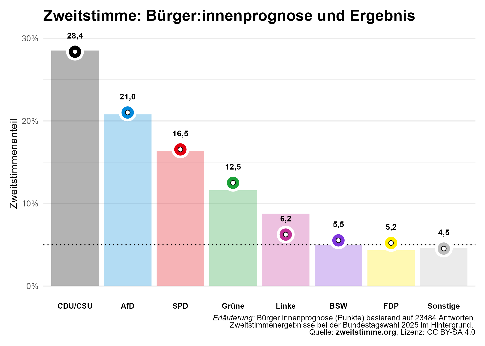
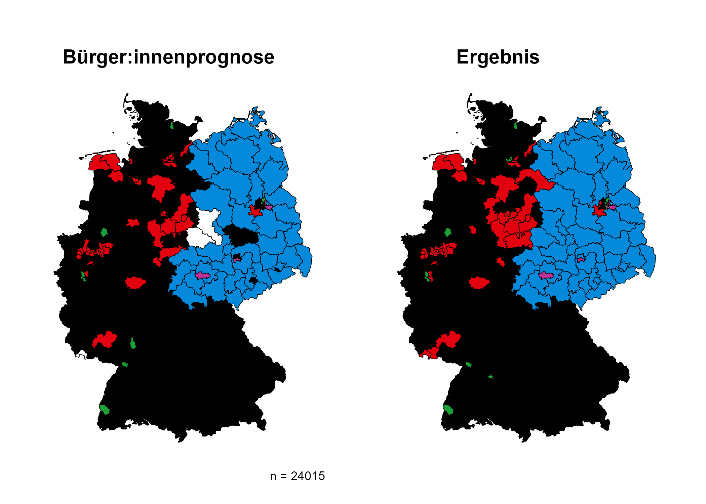

Nach der Wahl ist die Zeit gekommen, unsere [Bürger:innenprognosen](https://zweitstimme.org/posts/blog/citizen-forecast/)
zu evaluieren. **Wie nah lagen die Bürger:innen am tatsächlichen Wahlergebnis?**

## Überblick

Bei den **Zweitstimmen** war die Bürger:innenprognose insbesondere für **CDU/CSU, AfD und SPD sehr akkurat**. Allerdings lagen **BSW und FDP über der 5% Hürde**. Im Schnitt wich die Prognose um 0,68 Prozentpunkte vom Ergebnis ab.
Auch die Vorhersage der Wahlkreisgewinner:innen war sehr gut und vergleichbar mit  [anderen Modellen](https://zweitstimme.org/posts/blog/evaluation-2025/). **Über 90% der Gewinner:innen** wurden **richtig** vorhergesagt. 

## Zweitstimmen

Nun etwas detaillierter zu den Zweitstimmen. Dazu hatten wir die Bürger:innen gefragt: *Wenn Sie zunächst an die Zweitstimmen denken, die über die Verteilung der Mandate im Bundestag entscheiden: Wie viel Prozent der Stimmen erwarten Sie, werden die verschiedenen Parteien bundesweit erhalten?*

Aus den Antworten wurde für jede Partei der Durchschnittswert berechnet – die Bürger:innenprognose.

### Sehr präzise Prognose für die drei größten Parteien

Die Grafik zeigt die Bürger:innenprognose für die Zweitstimmenanteile der Parteien als Punkte. Die Balken im Hintergrund stellen das tatsächliche Wahlergebnis da. 
Wenn man Punkte und Balken vergleicht, fällt auf, dass die Prognose für die drei größten Parteien sehr präzise war. Die vorhergesagten Werte für **CDU/CSU, AfD, SPD und auch Sonstige** weichen um **weniger als 0,3 Prozentpunkte** von dem tatsächlichen Wahlergebnis ab.

Allerdings gab es auch größere Abweichungen. Die **Grünen** wurden um **0,9 Prozentpunkte** überschätzt, während die **Linke** mit einer Unterschätzung von **2,54 Prozentpunkten** am stärksten von der Prognose abwich. 
Bei **BSW und FDP** lagen die Prognosen einen halben bzw. ganzen Prozentpunkt über dem tatsächlichen Ergebnis. Basierend auf dem prognostizierten Stimmenanteil **wären** beide Parteien **in den Bundestag eingezogen**, da die Werte über der 5%-Hürde lagen.

Insgesamt lag die **Bürger:innenprognose aber sehr nah am tatsächlichen Wahlergebnis**. Der mittlere absolute Fehler (MAE) beträgt 0,68 Prozentpunkte – und damit ist diese Methode sogar etwas präziser als unser  [Zweitstimmen-Modell](https://zweitstimme.org/posts/blog/zweitstimme-model/) (MAE = 0,78). Zudem ist sie auch präziser als die Bürger:innenprognosen von 2021, die von [Arndt Leininger und Kollegen](https://doi.org/10.1007/978-3-658-42694-1_15) erstellt wurde (MAE = 1,4).
Ob diese Wahl insgesamt leichter vorherzusagen war oder was Gründe für die gute Präzision sein könnten, bedarf weiterer Analysen.

## Einzug ins Parlament: Linke drin, BSW und FDP draußen

Da für Die Linke, das BSW und die FDP von einem knappen Rennen um die 5%-Hürde ausgegangen wurde, haben wir die Bürger:innen nicht nur nach ihrer Zweitstimmenpräferenz gefragt, sondern auch nach ihrer Einschätzung, ob diese Parteien den Einzug in den Bundestag schaffen.
*Um im Bundestag vertreten zu sein, benötigt eine Partei 5 % der Zweitstimmen oder drei Direktmandate. Für wie wahrscheinlich halten Sie es, dass die folgenden Parteien bei der bevorstehenden Bundestagswahl jeweils im Bundestag vertreten sein werden?*

Das Ergebnis zeigt: die **Mehrheit der Befragten lag mit ihrer Einschätzung für alle drei Parteien richtig**.

  - Die Mehrheit (67 %) hielt es für (sehr) wahrscheinlich, dass Die Linke im Bundestag vertreten sein wird – eine korrekte Einschätzung. 
  - Eine Mehrheit von 56 % erwartete den denkbar knappen Nicht-Einzug des BSW – was sich als zutreffend erwies. 
  - Mehrheitlich wurde zudem (von 68 %) richtigerweise erwartet, dass die FDP nicht in den Bundestag einzieht. 

Während die Bürger:innenprognose für die Zweitstimmen das BSW und die FDP über der 5 % Hürde sahen, war die Einschätzung zum Einzug ins Parlament treffsicherer. 
Dies untermalt, dass Erwartungen für Zweitstimmen abzugeben, eine schwierige Aufgabe ist. Umso bemerkenswerter ist es, dass die Zweitstimmenprognose im Schnitt so präzise war.
 

## Prognosen zu Kanzler:in und Koalition

Ob die Erwartungen der Bürger:innen hinsichtlich der Kanzlerschaft und der Koalitionsbildung ebenfalls zutreffen, wird sich erst in den kommenden Wochen zeigen. Einige Ergebnisse erscheinen jedoch bereits jetzt realistisch:

 - 74 % der Befragten erwarteten, dass **Friedrich Merz** der nächste Bundeskanzler wird – angesichts der Wahlergebnisse eine sehr wahrscheinliche Entwicklung.
 - Die meistgenannte Koalitionsmöglichkeit, eine **CDU/CSU-SPD-Regierung** (46 %), ist rechnerisch möglich.
 - Die **zweitmeist erwartete Koalition (CDU/CSU, SPD und Grüne, 11 %)** wäre ebenfalls rechnerisch umsetzbar, jedoch unwahrscheinlich, da ein Zweierbündnis aus CDU/CSU und SPD möglich ist.
 - Die **drittmeist genannte Koalition (CDU/CSU und AfD, 11 %)** ist rechnerisch ebenfalls machbar, scheint politisch jedoch unwahrscheinlich.

## Erststimmen

*Und nun noch zu Ihrer Erwartung im eigenen Wahlkreis: Welcher Kandidat oder welche Kandidatin wird bei der Bundestagswahl in Ihrem Wahlkreis  die meisten Stimmen gewinnen?*

Die linke Grafik zeigt die Bürger:innenprognose für die Gewinner:innen der Erststimmen in den Wahlkreisen. Die rechte Grafik zeigt die tatsächlichen Gewinner:innen. Die Farben repräsentieren die Parteien.

### Über 90 % der Wahlkreisgewinner:innen richtig vorhergesagt

In **271 Wahlkreisen** lagen die Bürger:innen **richtig**. Damit ist die Quote ähnlich gut wie von anderen Modellen, wie unserem [Erststimmen-Modell](https://zweitstimme.org/posts/blog/erststimme-model/).

In drei Wahlkreisen - in weiß eingezeichnet - lagen zwei Parteien gleichauf, und letztlich gewann jeweils eine der beiden erwarteten Parteien:

- In **Börde – Salzlandkreis** und **Harz** setzte sich die **AfD** statt der alternativ prognostizierten **CDU** durch.
- In **Saarbrücken** gewann die **SPD** anstelle der **CDU**.

Obwohl die Prognose in diesen Fällen nicht exakt war, lag sie dennoch in der richtigen Richtung.

### Wo die Prognose daneben lag

In **25 Wahlkreisen** wich die Bürger:innenprognose vom tatsächlichen Wahlergebnis ab.
Auffällig ist, dass dies vor allem **städtische Wahlkreise** betraf. Besonders in **Berlin** und **Hamburg** gab es mehrere Abweichungen. 
Die Wahlkreise in denen die Vorhersagen falsch lagen, sind in der Tabelle zu sehen.

<table>
 <thead>
  <tr>
   <th style="text-align:left;"> Wahlkreis </th>
   <th style="text-align:left;"> Name </th>
   <th style="text-align:left;"> Vorhergesagt </th>
   <th style="text-align:left;"> Gewonnen </th>
  </tr>
 </thead>
<tbody>
  <tr>
   <td style="text-align:left;"> 019 </td>
   <td style="text-align:left;"> Hamburg-Altona </td>
   <td style="text-align:left;"> SPD </td>
   <td style="text-align:left;"> GRÜNE </td>
  </tr>
  <tr>
   <td style="text-align:left;"> 020 </td>
   <td style="text-align:left;"> Hamburg-Eimsbüttel </td>
   <td style="text-align:left;"> SPD </td>
   <td style="text-align:left;"> GRÜNE </td>
  </tr>
  <tr>
   <td style="text-align:left;"> 021 </td>
   <td style="text-align:left;"> Hamburg-Nord </td>
   <td style="text-align:left;"> SPD </td>
   <td style="text-align:left;"> CDU/CSU </td>
  </tr>
  <tr>
   <td style="text-align:left;"> 037 </td>
   <td style="text-align:left;"> Lüchow-Dannenberg – Lüneburg </td>
   <td style="text-align:left;"> CDU/CSU </td>
   <td style="text-align:left;"> SPD </td>
  </tr>
  <tr>
   <td style="text-align:left;"> 040 </td>
   <td style="text-align:left;"> Nienburg II – Schaumburg </td>
   <td style="text-align:left;"> CDU/CSU </td>
   <td style="text-align:left;"> SPD </td>
  </tr>
  <tr>
   <td style="text-align:left;"> 047 </td>
   <td style="text-align:left;"> Hannover-Land II </td>
   <td style="text-align:left;"> CDU/CSU </td>
   <td style="text-align:left;"> SPD </td>
  </tr>
  <tr>
   <td style="text-align:left;"> 052 </td>
   <td style="text-align:left;"> Goslar – Northeim – Göttingen II </td>
   <td style="text-align:left;"> CDU/CSU </td>
   <td style="text-align:left;"> SPD </td>
  </tr>
  <tr>
   <td style="text-align:left;"> 053 </td>
   <td style="text-align:left;"> Göttingen I </td>
   <td style="text-align:left;"> SPD </td>
   <td style="text-align:left;"> CDU/CSU </td>
  </tr>
  <tr>
   <td style="text-align:left;"> 070 </td>
   <td style="text-align:left;"> Anhalt – Dessau – Wittenberg </td>
   <td style="text-align:left;"> CDU/CSU </td>
   <td style="text-align:left;"> AfD </td>
  </tr>
  <tr>
   <td style="text-align:left;"> 077 </td>
   <td style="text-align:left;"> Berlin-Spandau – Charlottenburg Nord </td>
   <td style="text-align:left;"> CDU/CSU </td>
   <td style="text-align:left;"> SPD </td>
  </tr>
  <tr>
   <td style="text-align:left;"> 080 </td>
   <td style="text-align:left;"> Berlin-Tempelhof-Schöneberg </td>
   <td style="text-align:left;"> CDU/CSU </td>
   <td style="text-align:left;"> GRÜNE </td>
  </tr>
  <tr>
   <td style="text-align:left;"> 081 </td>
   <td style="text-align:left;"> Berlin-Neukölln </td>
   <td style="text-align:left;"> CDU/CSU </td>
   <td style="text-align:left;"> Die Linke </td>
  </tr>
  <tr>
   <td style="text-align:left;"> 082 </td>
   <td style="text-align:left;"> Berlin-Friedrichshain-Kreuzberg – Prenzlauer Berg Ost </td>
   <td style="text-align:left;"> GRÜNE </td>
   <td style="text-align:left;"> Die Linke </td>
  </tr>
  <tr>
   <td style="text-align:left;"> 092 </td>
   <td style="text-align:left;"> Köln I </td>
   <td style="text-align:left;"> CDU/CSU </td>
   <td style="text-align:left;"> SPD </td>
  </tr>
  <tr>
   <td style="text-align:left;"> 117 </td>
   <td style="text-align:left;"> Mülheim – Essen I </td>
   <td style="text-align:left;"> CDU/CSU </td>
   <td style="text-align:left;"> SPD </td>
  </tr>
  <tr>
   <td style="text-align:left;"> 120 </td>
   <td style="text-align:left;"> Recklinghausen I </td>
   <td style="text-align:left;"> CDU/CSU </td>
   <td style="text-align:left;"> SPD </td>
  </tr>
  <tr>
   <td style="text-align:left;"> 124 </td>
   <td style="text-align:left;"> Bottrop – Recklinghausen III </td>
   <td style="text-align:left;"> SPD </td>
   <td style="text-align:left;"> CDU/CSU </td>
  </tr>
  <tr>
   <td style="text-align:left;"> 131 </td>
   <td style="text-align:left;"> Bielefeld – Gütersloh II </td>
   <td style="text-align:left;"> CDU/CSU </td>
   <td style="text-align:left;"> SPD </td>
  </tr>
  <tr>
   <td style="text-align:left;"> 132 </td>
   <td style="text-align:left;"> Herford – Minden-Lübbecke II </td>
   <td style="text-align:left;"> SPD </td>
   <td style="text-align:left;"> CDU/CSU </td>
  </tr>
  <tr>
   <td style="text-align:left;"> 151 </td>
   <td style="text-align:left;"> Leipzig I </td>
   <td style="text-align:left;"> CDU/CSU </td>
   <td style="text-align:left;"> AfD </td>
  </tr>
  <tr>
   <td style="text-align:left;"> 158 </td>
   <td style="text-align:left;"> Dresden I </td>
   <td style="text-align:left;"> CDU/CSU </td>
   <td style="text-align:left;"> AfD </td>
  </tr>
  <tr>
   <td style="text-align:left;"> 161 </td>
   <td style="text-align:left;"> Chemnitz </td>
   <td style="text-align:left;"> CDU/CSU </td>
   <td style="text-align:left;"> AfD </td>
  </tr>
  <tr>
   <td style="text-align:left;"> 258 </td>
   <td style="text-align:left;"> Stuttgart I </td>
   <td style="text-align:left;"> CDU/CSU </td>
   <td style="text-align:left;"> GRÜNE </td>
  </tr>
  <tr>
   <td style="text-align:left;"> 274 </td>
   <td style="text-align:left;"> Heidelberg </td>
   <td style="text-align:left;"> GRÜNE </td>
   <td style="text-align:left;"> CDU/CSU </td>
  </tr>
  <tr>
   <td style="text-align:left;"> 299 </td>
   <td style="text-align:left;"> Homburg </td>
   <td style="text-align:left;"> CDU/CSU </td>
   <td style="text-align:left;"> SPD </td>
  </tr>
</tbody>
</table>

In den nächsten Wochen werden wir uns diese Wahlkreise noch einmal genauer anschauen.

Erststimmenanteile ließen sich aus unseren gestellten Fragen auch ableiten, da wir die Bürger:innen analog zur Zweitstimmenverteilung auch nach der Erststimmenverteilung gefragt haben. Bei diesen nicht publizierten Prognosen lag der mittlere absolute Fehler über alle Wahlkreise hinweg bei 3.
Dies ist besser als 2021 (3,5), aber schlechter als das diesjährige [Erststimmen-Modell](https://zweitstimme.org/posts/blog/erststimme-model/), das mit einem mit einem mittleren absoluten Fehler von 2,2 präziser war.

## Fazit

Insgesamt erwiesen die Bürger:innenprognosen sich als sehr präzise. Die Zweitstimmenprognose lag im Schnitt sogar näher am tatsächlichen Wahlergebnis als unser Zweitstimmen-Modell – auch wenn sie BSW und FDP knapp über der 5%-Hürde sah.
Interessanterweise erwartete die Mehrheit der Befragten dennoch korrekt, dass weder BSW noch FDP in den Bundestag einziehen.
Dies gibt uns auch Aufschluss darüber, dass unterschiedliche Fragen zu unterschiedlichen Prognosen kommen können. 

Auch die Prognosen zu den Wahlkreisgewinner:innen waren beeindruckend: In 271 Wahlkreisen lagen die Bürger:innen richtig. In den kommenden Wochen werden wir uns die Wahlkreise, in denen die Prognose nicht zutraf, noch einmal genauer ansehen. Zudem werden wir die Prognosen der Erststimmenanteile weiter analysieren.
