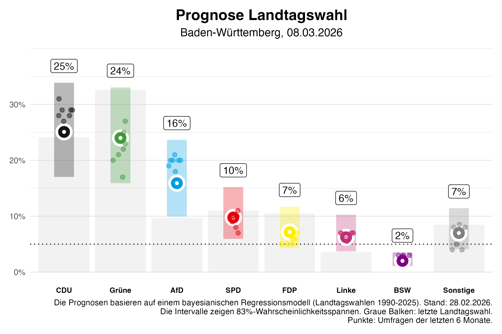
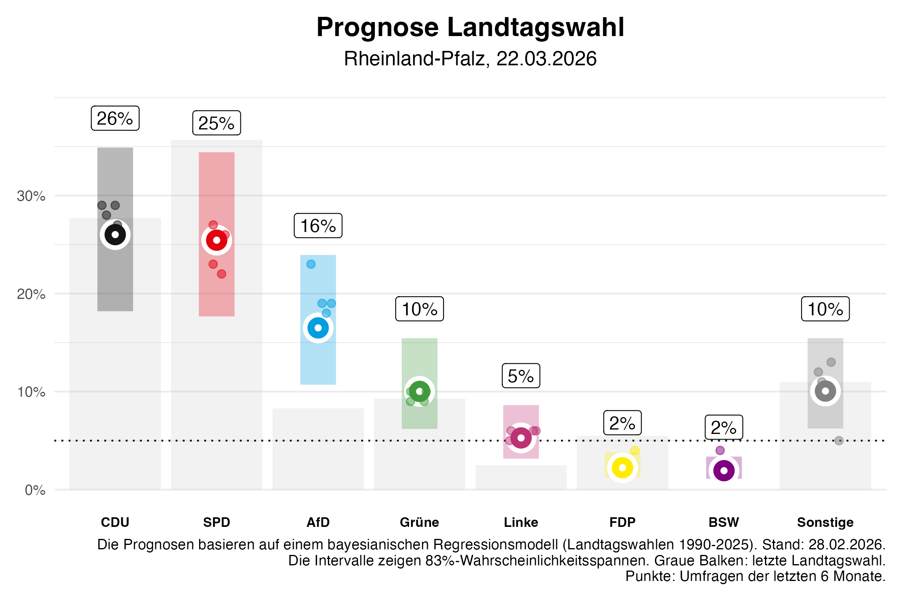
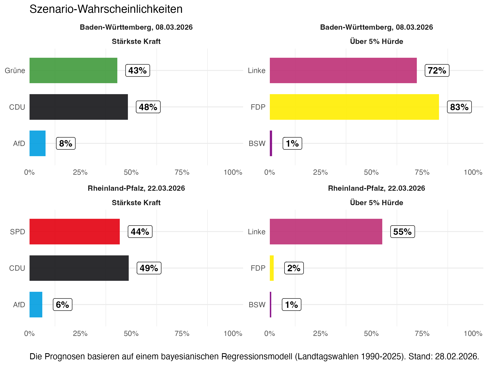

Heute veröffentlichen wir unsere Vorhersage für die Landtagswahlen in Baden-Württemberg und Rheinland-Pfalz – **8 bzw. 22 Tage vor der nächsten Wahl**. Unser Vorhersagemodell basiert auf unserem neuen Modell für Landtagswahlen ([Stoetzer et al. (2025), *An election forecasting model for subnational elections*, Electoral Studies](https://www.sciencedirect.com/science/article/pii/S0261379425000459)). Wir schätzen Bayes'sche Regressionsmodelle (Log-Ratio-Stimmenanteil) auf allen deutschen Landtagswahlen von 1990 bis 2025 und erzeugen 5/6-Kredibilitätsintervalle sowie Szenario-Wahrscheinlichkeiten für bevorstehende Wahlen.

---

## Die Vorhersage

Die folgenden Werte sind **Punktschätzungen** (Median unserer Posterior-Verteilung); die Intervalle in Klammern geben die Unsicherheit an. Unser Modell erwartet, dass das tatsächliche Wahlergebnis mit etwa **83% Wahrscheinlichkeit** in diesem Bereich liegt (5/6-Kredibilitätsintervall). Dass das Endergebnis außerhalb des Intervalls liegt, ist etwa so wahrscheinlich wie eine 6 mit einem Würfel – möglich, aber nicht sehr wahrscheinlich.

### Baden-Württemberg

In Baden-Württemberg zeigt unsere aktuelle Vorhersage ein Kopf-an-Kopf-Rennen zwischen **CDU** und **Grünen**. Wir erwarten für die **CDU** etwa **25%** der Stimmen (Intervall: 17% bis 34%), für die **Grünen** etwa **24%** (16% bis 33%). Die **AfD** liegt mit **16%** (10–24%) dahinter, gefolgt von der **SPD** mit **10%** (6–15%), der **FDP** mit **7%** (4–12%), der **Linke** mit **6%** (4–10%), dem **BSW** mit **2%** (1–4%) und **Sonstige** mit **7%** (4–11%).

### Rheinland-Pfalz

In Rheinland-Pfalz erwarten wir ebenfalls ein enges Rennen: Die **CDU** liegt mit **26%** (18–35%) etwa gleichauf mit der **SPD** mit **25%** (18–34%), dahinter die **AfD** mit **16%** (11–24%). Die **Grünen** könnten **10%** (6–15%) erreichen, die **Linke** **5%** (3–9%), die **FDP** **2%** (1–4%), das **BSW** **2%** (1–3%) und **Sonstige** **10%** (6–15%; hier sind auch die FW enthalten).

---

## Unsicherheit und Darstellung in den Abbildungen

Unsere Vorhersagen sind mit **Unsicherheit** behaftet – je näher die Wahl rückt, desto genauer werden sie typischerweise. Die **5/6-Kredibilitätsintervalle** (≈83% Wahrscheinlichkeit) zeigen den Bereich, in dem das Endergebnis mit hoher Wahrscheinlichkeit liegen wird. Ein breiteres Intervall bedeutet mehr Unsicherheit; ein engeres Intervall bedeutet, dass wir uns sicherer sind.

**In den Prognose-Grafiken** sehen Sie pro Partei:
- **Graue Balken**: das Ergebnis der letzten Landtagswahl (zum Vergleich)
- **Farbige Balken mit Intervall**: unsere Vorhersage – der Punkt ist der erwartete Stimmenanteil (Median), die vertikalen Linien markieren das 5/6-Kredibilitätsintervall
- **Punkte**: einzelne Umfragen der letzten sechs Monate

---

## Szenario-Wahrscheinlichkeiten

Neben den Stimmenanteilen berechnen wir **Wahrscheinlichkeiten für bestimmte Szenarien** – z.B. welche Partei stärkste Kraft wird oder ob eine Partei die 5%-Hürde schafft. Diese Werte stammen aus den Posterior-Draws unseres Modells: Wir zählen, in wie vielen simulierten Wahlausgängen das jeweilige Ereignis eintritt.

**Baden-Württemberg:** Stärkste Kraft: **CDU** etwa **48%**, **Grünen** etwa **43%**, **AfD** etwa **8%**. Bei der 5%-Hürde: Die **FDP** hat etwa **83%** und die **Linke** etwa **72%** Chance, in den Landtag einzuziehen; das **BSW** liegt bei etwa **1%**.

**Rheinland-Pfalz:** Stärkste Kraft: **CDU** etwa **49%**, **SPD** etwa **44%**, **AfD** etwa **6%**. Über die 5%-Hürde: Die **Linke** hat etwa **55%**, die **FDP** etwa **2%** und das **BSW** etwa **1%** Chance.

---

## Was fließt in die Vorhersage ein?

In beiden Ländern zeigen die letzten Umfragen teils kräftige Zugewinne für die Zweitplatzierten (Grüne in BW, SPD in RLP). Unser Modell nutzt **alle bis zum Stichtag verfügbaren Umfragen** – damit sind solche jüngeren Bewegungen in den Daten enthalten. Wir **projizieren aber keine zusätzliche Dynamik** in die Zeit bis zur Wahl: Was in den Umfragen steht, geht ein; einen expliziten „Last-Minute“- oder Amtsinhaber-Bonus modellieren wir nicht. Die Vorhersage kombiniert die aktuellen Umfragen mit dem letzten Wahlergebnis, Bundestrends und einem Indikator für die **Partei** des bzw. der Regierungschef\*in. In der Modellschätzung über alle Landtagswahlen seit 1990 erhält der **latente Umfragewert** (aus den letzten Umfragen) mit Abstand das größte Gewicht; **letztes Wahlergebnis** und **Amtsinhaber\*in** (ob die Partei die Regierungschefin bzw. den Regierungschef stellt) spielen eine deutlich kleinere, aber sichtbare Rolle, **Bundestrends** und **Regierungspartei** noch weniger. Wir erfassen dabei nur die **Partei** des bzw. der Regierungschef\*in, nicht die konkrete Person; in Baden-Württemberg setzen wir dafür die **Grünen** als Amtsinhaber-Partei, da wir keine personenbezogenen Daten nutzen.

---

## Technische Änderungen am Modell

Im Folgenden die wichtigsten **Abweichungen vom Paper**:

**Dynamische Lead Times:** Keine festen Vorlaufzeiten (2, 14, 60 Tage) mehr; wir passen die Lead Times an das aktuelle Datum und jede Wahl an.

**Parteien und Sonstige:** Fester Satz von acht „Parteien“ (CDU/CSU, SPD, Grüne, FDP, AfD, Linke, BSW, Sonstige). Sonstige wird als Partei modelliert, mit eigener Vorhersage; anschließend normalisieren wir jeden Draw auf 100%.

**BSW:** Als Vorhersage-Partei einbezogen, in Umfragen aber nur ab 2024. Bisher gab es keine Landtagswahlergebnisse für das BSW, daher konnte die Partei im ursprünglichen Modell nicht berücksichtigt werden.

**Neue-Partei-Variable entfernt:** Die Umfragen erfassen die Dynamik neuer Parteien bereits zu einem großen Teil.

**Median und 5/6-Intervall:** Punkt-Vorhersage = Median; Intervall = 1/12- und 11/12-Quantile (≈83%). Für die hier verwendeten Modelle (8 und 22 Tage vor der Wahl) beträgt der **MAE** (mittlere absolute Abweichung) etwa **2,5 Prozentpunkte** – also die durchschnittliche Abweichung unserer Vorhersage vom tatsächlichen Wahlergebnis. Ermittelt haben wir das per **Leave-one-out**: Für jede vergangene Landtagswahl trainieren wir das Modell auf allen anderen Wahlen, sagen die ausgelassene Wahl vorher und vergleichen mit dem Endergebnis.
