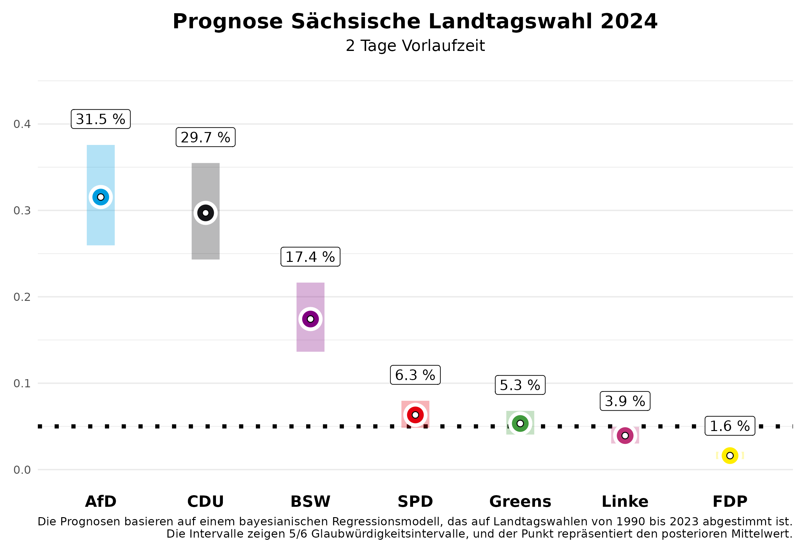

Vor zwei Wochen haben wir Vorhersagen für die Landtagswahlen in Sachsen und Thüringen hier publiziert. Diese aktualisieren wir heute – zwei Tage vor der Wahl – mit unserem Vorhersagemodell, basierend auf den in der Zwischenzeit veröffentlichten Umfragen für Sachsen und Thüringen. Anhand der vorherigen Landtagswahlen von 2010 bis 2023 wissen wir, dass unsere Vorhersagen zwei Tage vorher bereits sehr genau sind. Wir liegen mit einer durchschnittlichen absoluten Abweichung von 1,46 Prozentpunkten für alle Parteien sehr nahe am Endergebnis.

# Die Vorhersage

## Sachsen

In Sachsen bleibt es bei dem spannenden Kopf-an-Kopf-Rennen zwischen der CDU und der AfD. Für die CDU erwarten wir **29,7%** der Stimmen, wobei unsere Vorhersage zwei Tage vor der Wahl noch eine 5/6-Wahrscheinlichkeit zulässt, dass dieser Wert im Kredibilitätsintervall zwischen **24,3%** und **35,5%** liegen wird. Die AfD wird sich deutlich verbessern und in unseren Erwartungen überholt sie mit **31,5%** knapp die CDU. Hier reicht das Intervall allerdings ebenfalls noch von **25,9%** bis **37,6%**. Das ergibt eine Wahrscheinlichkeit von **62.8%**, dass die AfD die stärkste Kraft wird.

Das neu gegründete Bündnis Sahra Wagenknecht (BSW) wird sicher in den Landtag einziehen, wir erwarten **17,4%** (5/6-Kredibilitätsintervall von **13,6%** bis **21,6%**). Für die SPD erwarten wir einen Wahlanteil von **6,3%** (Intervall: **4,8% bis 8,0%**). Für die Grünen wird es mit einem erwarteten Anteil von **5,3%** (Intervall: **4,1% bis 6,8%**) spannend, ob sie in den Landtag einziehen. Die Wahrscheinlichkeit dafür liegt bei **60%**. Die Chancen für die Linke stehen schlecht bei **3,9%** (Intervall: **3,0% bis 4,9%**). Die FDP wird den Einzug in den Landtag mit voraussichtlich **1,6%** (Intervall: **1,2% bis 2,1%**) deutlich verfehlen. Die restlichen Stimmenanteile entfallen auf „sonstige” Parteien, die in den Abbildungen nicht dargestellt sind.

Was bedeutet das für die mögliche Regierungsbildung? Die Wahrscheinlichkeit, dass es eine Parlamentsmehrheit für die amtierende CDU-SPD-Grünen-Regierung gibt, ist mit **7%** eher gering, was auch mit der unsicheren Einzugswahrscheinlichkeit der Grünen zu tun hat. Eine Regierungsmehrheit für die CDU ohne Beteiligung der AfD ist am wahrscheinlichsten mit dem BSW (**78%**), besonders unter Hinzunahme der SPD (**88%**).

## Thüringen

In Thüringen wird die AfD voraussichtlich die stärkste Kraft mit einer Wahrscheinlichkeit von **88%**. Wir erwarten, dass sie **29,5%** der Stimmen erhalten wird. Zwei Tage vor der Wahl gibt es jedoch noch Spielraum in unserer Vorhersage; das 5/6-Kredibilitätsintervall liegt zwischen **23,9%** und **35,4%**. Wir gehen davon aus, dass die Linke deutlich an Zustimmung verlieren wird: **14,3%** (Intervall: **11,3% bis 17,7%**). Die CDU könnte etwa **20,7%** erreichen, wobei das Intervall von **16,5%** bis **25,2%** reicht.

Das Bündnis Sahra Wagenknecht (BSW) könnte mit **22,9%** einen überraschenden Erfolg verbuchen und als starke Partei in den Landtag einziehen (Intervall: **18,0% bis 27,7%**). Die Grünen dürften mit **3,3%** (Intervall: **2,5% bis 4,2%**) und die SPD mit **6,0%** (Intervall: **4,6% bis 7,5%**) eher im unteren Bereich verbleiben. Auch in Thüringen hat die FDP mit **2,4%** (Intervall: **1,8% bis 3,0%**) kaum Aussichten, die Fünf-Prozent-Hürde zu überwinden.

Mit diesem Ergebnis wird es schwierig, eine Mehrheitsregierung zu organisieren, die ohne Beteiligung der AfD auskommt. Es ist jetzt schon klar, dass die bisherige Minderheitsregierung aus Linken, SPD und Grünen keine Mehrheitskonstellation mehr darstellt; die Wahrscheinlichkeit dafür ist 0%. Stattdessen sind andere Bündnisse möglich, aber nicht unbedingt politisch gewollt. Eine Koalition zwischen der CDU, dem BSW und der SPD erreicht mit **67%** Wahrscheinlichkeit eine parlamentarische Mehrheit, während ein Bündnis des BSW, der Linken und der SPD mit **13%** Wahrscheinlichkeit eine Mehrheit erzielen könnte. Es bleibt also auch nach der Wahl politisch spannend.

# Das Vorhersagemodell

Am Kongress der Deutschen Vereinigung für Politikwissenschaften 2024, vom 24.-27.09. in Göttingen, werden wir ein Forschungspapier zu unserem Vorhersagemodell für Landtagswahlen vorstellen. Unsere Vorhersagen basieren auf einem Bayes'schen Regressionsmodell, das wir auf den Daten aller Landtagswahlen seit 1990 schätzen und dann zur Vorhersage der bevorstehenden Landtagswahlen nutzen. Zur Vorhersage nutzen wir Informationen über die Regierungsbeteiligung der Parteien, ob eine Partei den/die Ministerpräsident/in stellt, ob eine Partei neu bei den Landtagswahlen antritt, das letzte Wahlergebnis der Partei, die durchschnittliche Abweichung der Partei in den bundesweiten Umfragen vom letzten Bundestagswahlergebnis und den durchschnittlichen Zuspruch in den Umfragen, die vor der Landtagswahl von den verschiedenen Umfrageinstituten publiziert werden. Die Umfragen im Land haben bei der Vorhersage den größten Einfluss.
