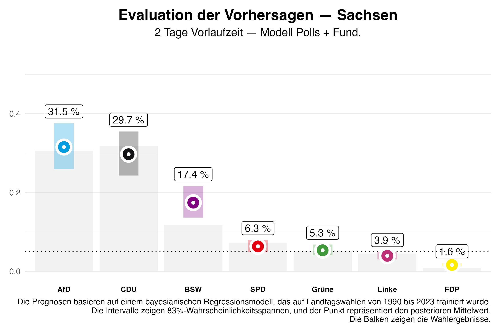
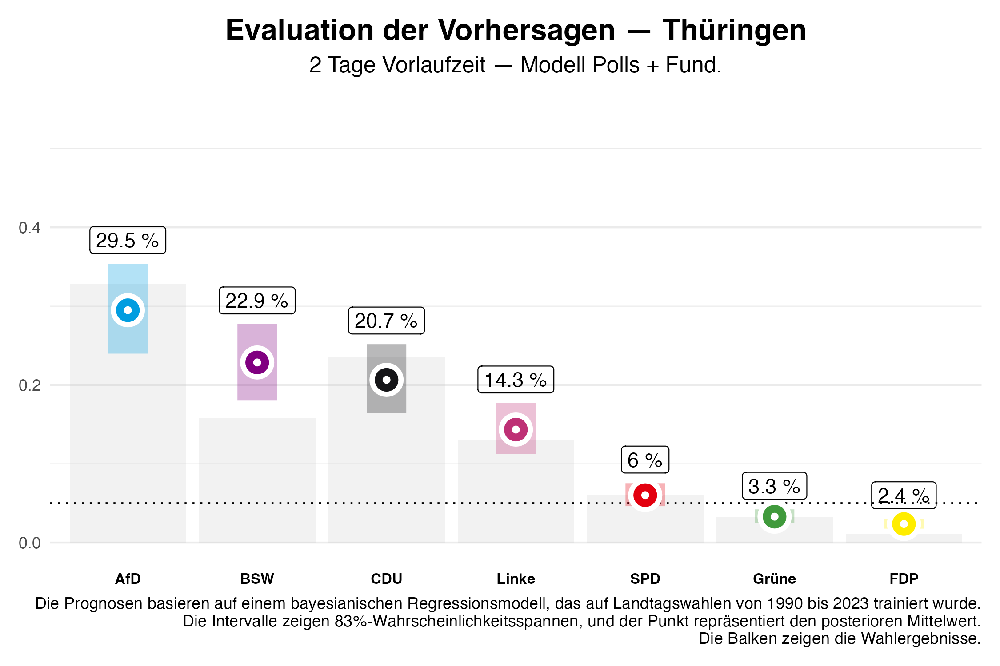
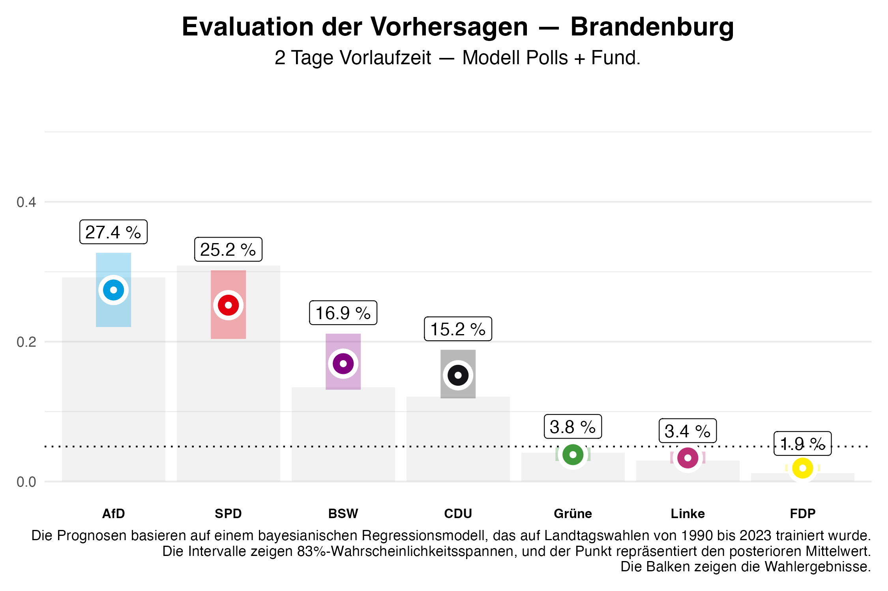

In diesem Beitrag evaluieren wir die auf unserer Seite veröffentlichten Vorhersagen für die Landtagswahlen in Sachsen, Thüringen und Brandenburg und vergleichen diese mit den tatsächlich erzielten Wahlergebnissen. Dabei bezieht sich der folgende Text auf die Vorhersagen, die zwei Tage vor den Wahlen veröffentlicht wurden.

# Evaluation der Vorhersagen

## Sachsen

Das Kopf-an-Kopf-Rennen zwischen der CDU und der AfD in Sachsen konnte die CDU knapp für sich gewinnen. Mit **31,9%** liegt der Wahlanteil der Partei **2,2%** oberhalb des zwei Tage vor der Wahl prognostizierten Wertes. Die AfD konnte sich auf **30,6%** verbessern und unterbietet damit unsere Prognose um **0,9%**.

Das erstmals angetretene Bündnis Sahra Wagenknecht (BSW) wurde bei der Prognose überschätzt: der prognostizierte Wahlanteil von **17,4%** ist mit einem reellen Anteil von **11,8%** deutlich darunter und außerhalb des 5/6-Kredibilitätsintervalls. Allerdings lässt das Modell eben erwarten, dass in einem von sechs Fällen unsere Vorhersage außerhalb dieses Bereiches liegt. SPD (**7,3%**), Grüne (**5,1%**) und Linke (**4,5%**) ziehen alle in den Landtag ein. Die Prognosen entsprachen mit kleineren Abweichungen den vorhergesagten Stimmanteilen (Prognose: SPD  **6,3%**, Grüne **5,3%**, Linke **3.9%**). Die Linke schafft mit **4,5%** der Stimmen den Einzug in den Landtag nur durch die Grundmandatsklausel. Wie prognostiziert, hat die FDP den Einzug in den Landtag verfehlt. 

Eine Parlamentsmehrheit für die amtierende CDU-SPD-Grünen-Regierung konnte trotz des unerwarteten Parlamentseinzugs der Grünen nicht erreicht werden. Die Wahrscheinlichkeit für eine solche Mehrheit wurde von uns vor der Wahl mit nur **7%** eingeschätzt. Eine von uns mit **78%** als wahrscheinlich eingeschätzte Regierungsmehrheit von CDU und BSW ist aufgrund des niedrigeren Stimmanteils des BSW allerdings unerwartet nicht möglich. Eine Mehrheit wäre nur unter Hinzunahme der SPD oder der Grünen zu erreichen.

## Thüringen

In Thüringen wird die AfD mit **32,8%** der Stimmen stärkste Kraft, was unser Modell mit einer Wahrscheinlichkeit von **88%** vorhergesagt hatte. Die CDU hat **23,6%** der Stimmen erreicht und übertrifft damit die Prognose von **20,7%** und wird die zweitstärkste Kraft. Die Linke verliert deutlich an Zustimmung und rutscht auf **13,1%**, **1,2%** etwas weniger als prognostiziert. So wie in Sachsen wurde das BSW bezogen auf den Stimmenanteil überschätzt: **15,8%** der Stimmen stehen gegen vorhergesagte **22,9%**. Damit liegt das Ergebnis wie in Sachsen auch außerhalb des Kredibilitätsintervalls. Die Wahlergebnisse von SPD (**6,1%**) und Grüne (**3,2%**) weichen nur gering von der Prognose ab (Prognose: SPD  **6,0%**, Grüne **3,3%**). Damit verfehlen die Grünen und auch die FDP die Fünf-Prozent-Hürde.

Mit diesem Ergebnis wird es schwierig, eine Mehrheitsregierung zu organisieren, die ohne Beteiligung der AfD auskommt. Einzig ein Bündnis aus CDU, BSW und Linken würde eine Mehrheit bilden. Damit kann die bisherige Minderheitsregierung aus Linken, SPD und Grünen keine Mehrheitskonstellation darstellen. Eine Koalition zwischen der CDU, dem BSW und der SPD, deren Chance auf eine parlamentarische Mehrheit von uns mit **67%** eingeschätzt wurde, erreichte nur knapp keine parlamentarische Mehrheit.

## Brandenburg

In Brandenburg zeigte sich der prognostizierte Zweikampf zwischen AfD und SPD, den die SPD schlussendlich mit **30,9%** zu **29,2%** Stimmanteilen für sich gewinnen konnte. Die SPD bleibt damit stärkste Kraft in Brandenburg und übertrifft sogar das 5/6-Kredibilitätsintervall. Vor der Wahl bezifferten wir die Wahrscheinlichkeit für die SPD als stärkste Kraft mit **35%** und schätzten die AfD als stärkste Kraft mit **64%** ein.

Wie in den beiden anderen Bundesländern wurde das BSW auch in Brandenburg überschätzt wobei der Stimmanteil von **13,5%** noch innerhalb des Kredibilitätsintervall liegt. Die Grünen, die Linke und die FDP schaffen es nicht über die Fünf-Prozent-Hürde.
Damit ist die amtierende Koalition abgewählt. Eine Regierungsbildung ohne Zunahme der AfD wäre nur für SPD und BSW alleine oder unter Hinzunahme der SPD möglich. Eine große Koalition ist knapp nicht möglich.

# Fazit

Unser Modell hat bei den Landtagswahlen insgesamt gute Prognosen geliefert, insbesondere bei den etablierten Parteien wie CDU, SPD, AfD und Grünen. Allerdings zeigt sich eine systematische Überschätzung des neu gegründeten BSW.

---

