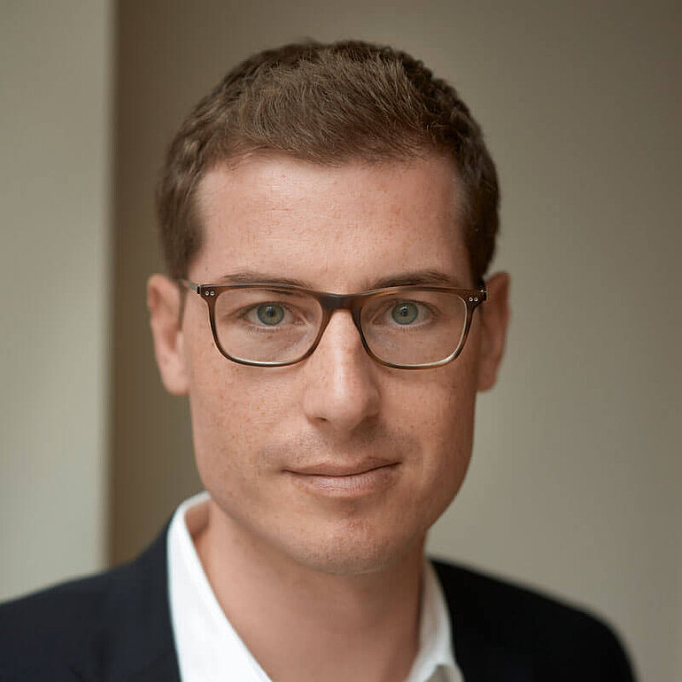
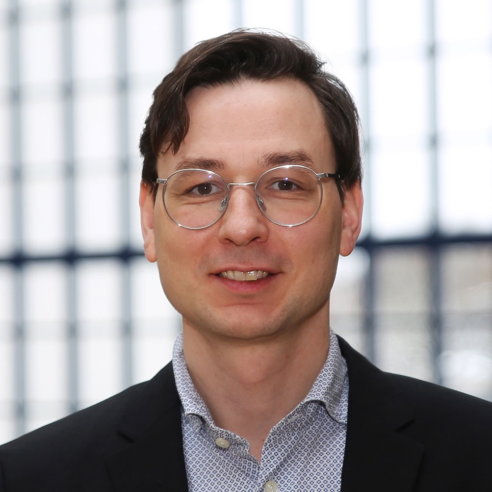
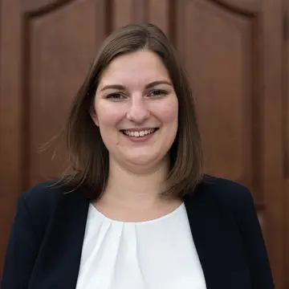
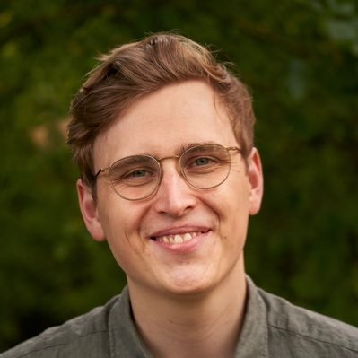

<section class="section-alt">
  

    

      

        
        

          <h3>Prof. Thomas Gschwend, PhD</h3>
          
Thomas Gschwend ist Professor am Fachbereich für Politikwissenschaft der Universität Mannheim. Seine Forschungsinteressen liegen in den Bereichen Wahlprognose, vergleichendes politisches Verhalten und Justizpolitik.

        

      

      

        
        

          <h3>Prof. Dr. Simon Munzert</h3>
          
Simon Munzert ist Professor of Data Science and Public Policy an der Hertie School. Zu seinen Forschungsinteressen gehören Meinungsbildung im digitalen Zeitalter, öffentliche Meinung und die Nutzung von Online-Daten in der Sozialforschung.

        

      

      

        
        

          <h3>Prof. Dr. Lukas F. Stoetzer</h3>
          
Lukas F. Stoetzer ist Professor für Quantitative Methoden am Fachbereich Wirtschaft und Gesellschaft der Universität Witten/Herdecke. Seine Forschungsinteressen liegen im Bereich des vergleichenden politischen Verhaltens und der politischen Methodologie.

        

      

      

        
        

          <h3>Cornelius Erfort</h3>
          
Cornelius Erfort ist wissenschaftlicher Mitarbeiter im DFG Projekt "Wahlprognosen für die Bundestagswahl 2025" an der Universität Witten/Herdecke. Seine Forschungsinteressen liegen in den Bereichen politischen Wettbewerb und vergleichendes politisches Verhalten.

        

      

      

        
        

          <h3>Hannah Rajski</h3>
          
Hannah Rajski promoviert im Rahmen des DFG Projekts "Wahlprognosen für die Bundestagswahl 2025" an der Universität Mannheim zu Bürgervorhersagen.

        

      

      

        
        

          <h3>Elias Koch</h3>
          
Elias Koch promoviert im Rahmen des DFG Projekts "Wahlprognosen für die Bundestagswahl 2025" an der Hertie School.

        

      

    

  

</section>

<h2>Assoziierte und ehemalige Mitglieder</h2>

<section class="section-alt">
  

    

      

        

          <h3>Dr. Marcel Neunhoeffer</h3>
          

            
Mehr erfahren

            
Marcel Neunhoeffer ist wissenschaftlicher Mitarbeiter am Arbeitsbereich Statistische Methoden des Instituts für Arbeitsmarkt- und Berufsforschung in Nürnberg und am Lehrstuhl für Statistik und Datenwissenschaft in den Sozial- und Geisteswissenschaften an der Ludwig-Maximilians-Universität München. In seiner Forschung konzentriert er sich auf die Anwendung von Deep-Learning-Algorithmen auf sozialwissenschaftliche Fragestellungen mit einem Schwerpunkt auf Datenschutz.

          

        

      

      

        

          <h3>Klara Müller</h3>
          

            
Mehr erfahren

            
Klara Müller promoviert an der Universität Mannheim. Ihre Forschungsinteressen liegen im Bereich der Politischen Psychologie und politischen Methodologie.

          

        

      

    

  

</section>

Wir sind ein Team von Wahlforscher:innen der Universität Mannheim, der Hertie School Berlin und der Universität Witten/Herdecke.

Unser Ziel ist es, einem breiten Publikum mithilfe unseres statistischen Modells Informationen und Prognosen zur Bundestagswahl an die Hand zu geben, die über die Momentaufnahmen der politischen Stimmung durch Meinungsumfragen (bspw. „Sonntagsfragen") hinausgehen.

Vorhersagen von zukünftigen Ereignissen, in diesem Fall dem Ausgang der Bundestagswahl, sind immer mit Unsicherheit behaftet. Daher ist es uns besonders wichtig, die Unsicherheit von Vorhersagemodellen wie dem von zweitstimme.org eindeutig und gut verständlich zu kommunizieren.

Diese Informationen können Journalist:innen, Expert:innen und Bürger:innen helfen, die tatsächliche Parteienunterstützung besser einzuschätzen, zu kommunizieren und letztlich besser informierte Wahlentscheidungen zu treffen.