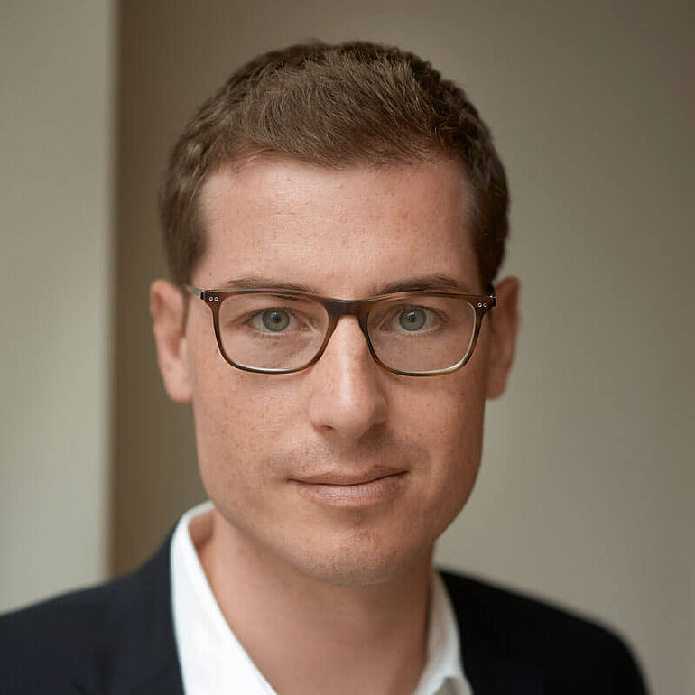
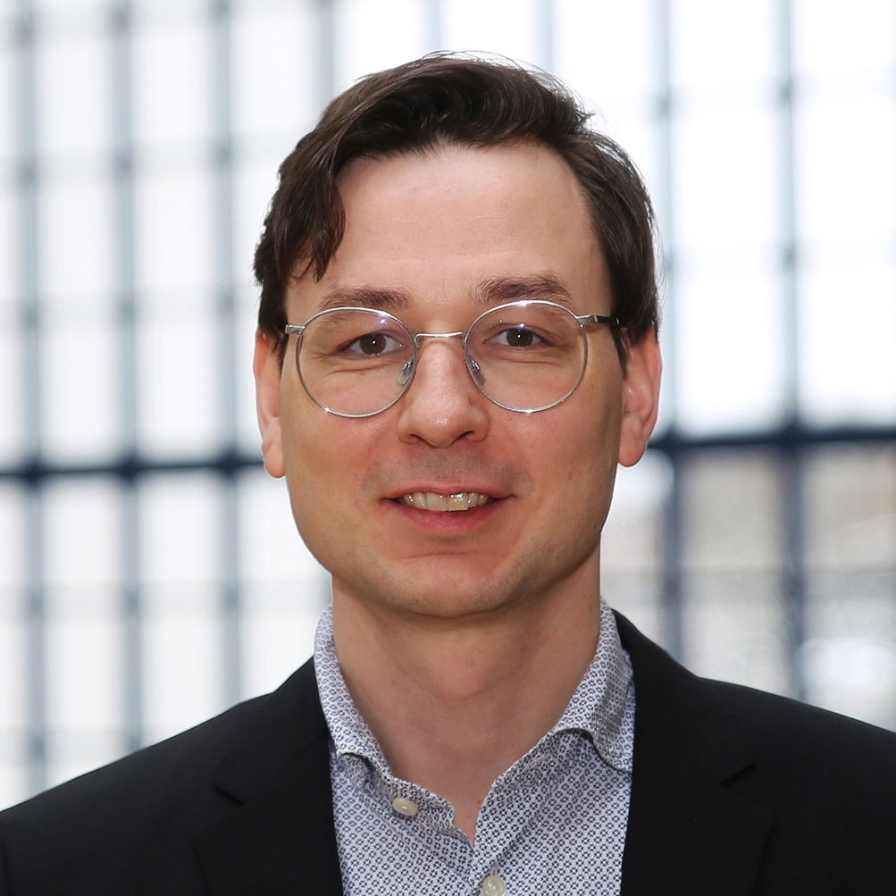
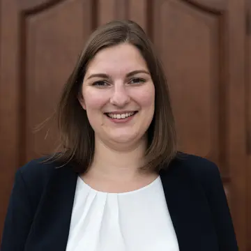
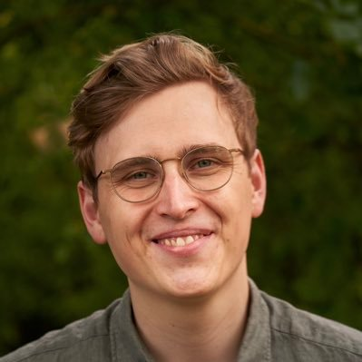

Wir sind ein Team von Wahlforscher:innen der Universität Mannheim, der Hertie School Berlin und der Universität Witten/Herdecke.

Unser Ziel ist es, einem breiten Publikum wissenschaftlich fundierte Prognosen und Umfrageanalysen an die Hand zu geben – über Momentaufnahmen der Sonntagsfrage hinaus, mit klar kommunizierter Unsicherheit.

<section class="team-section">
  <h2 class="team-section-title">Kernteam</h2>
  

    <article class="team-card">
      
      

        <h3>Prof. Thomas Gschwend, PhD</h3>
        
Thomas Gschwend ist Professor am Fachbereich für Politikwissenschaft der Universität Mannheim. Seine Forschungsinteressen liegen in den Bereichen Wahlprognose, vergleichendes politisches Verhalten und Justizpolitik.

      

    </article>
    <article class="team-card">
      
      

        <h3>Prof. Dr. Simon Munzert</h3>
        
Simon Munzert ist Professor of Data Science and Public Policy an der Hertie School. Zu seinen Forschungsinteressen gehören Meinungsbildung im digitalen Zeitalter, öffentliche Meinung und die Nutzung von Online-Daten in der Sozialforschung.

      

    </article>
    <article class="team-card">
      
      

        <h3>Prof. Dr. Lukas F. Stoetzer</h3>
        
Lukas F. Stoetzer ist Professor für Quantitative Methoden am Fachbereich Wirtschaft und Gesellschaft der Universität Witten/Herdecke. Seine Forschungsinteressen liegen im Bereich des vergleichenden politischen Verhaltens und der politischen Methodologie.

      

    </article>
    <article class="team-card">
      
      

        <h3>Dr. Cornelius Erfort</h3>
        
Cornelius Erfort ist wissenschaftlicher Mitarbeiter im DFG-Projekt „Wahlprognosen für die Bundestagswahl 2025“ an der Universität Witten/Herdecke. Seine Forschungsinteressen liegen in den Bereichen politischer Wettbewerb und vergleichendes politisches Verhalten.

      

    </article>
    <article class="team-card">
      
      

        <h3>Hannah Rajski</h3>
        
Hannah Rajski promoviert im Rahmen des DFG-Projekts „Wahlprognosen für die Bundestagswahl 2025“ an der Universität Mannheim zu Bürgervorhersagen.

      

    </article>
    <article class="team-card">
      
      

        <h3>Elias Koch</h3>
        
Elias Koch promoviert im Rahmen des DFG-Projekts „Wahlprognosen für die Bundestagswahl 2025“ an der Hertie School.

      

    </article>
  

</section>

<section class="team-section">
  <h2 class="team-section-title">Assoziierte und ehemalige Mitglieder</h2>
  

    <article class="team-card team-card-text">
      

        <h3>Dr. Marcel Neunhoeffer</h3>
        
Marcel Neunhoeffer ist wissenschaftlicher Mitarbeiter am Arbeitsbereich Statistische Methoden des Instituts für Arbeitsmarkt- und Berufsforschung in Nürnberg und am Lehrstuhl für Statistik und Datenwissenschaft in den Sozial- und Geisteswissenschaften an der Ludwig-Maximilians-Universität München. In seiner Forschung konzentriert er sich auf die Anwendung von Deep-Learning-Algorithmen auf sozialwissenschaftliche Fragestellungen mit einem Schwerpunkt auf Datenschutz.

      

    </article>
    <article class="team-card team-card-text">
      

        <h3>Dr. Klara Müller</h3>
        
Klara Müller ist Politikwissenschaftlerin an der Universität Mannheim, wo sie 2026 promoviert hat. Ihre Forschungsschwerpunkte liegen in vergleichendem politischem Verhalten und quantitativen Methoden, insbesondere Survey-Methodologie und Messproblemen. Zuvor war sie unter anderem am Lehrstuhl für Politische Psychologie und am MZES tätig und Mitglied des Projektteams der German Longitudinal Election Study (GLES); für die Bundestagswahl 2021 arbeitete sie im Team von zweitstimme.org.

      

    </article>
  

</section>

Vorhersagen sind immer mit Unsicherheit behaftet. Deshalb ist es uns besonders wichtig, diese Unsicherheit eindeutig und verständlich zu kommunizieren – damit Journalist:innen, Expert:innen und Bürger:innen die tatsächliche Parteienunterstützung besser einschätzen können.

